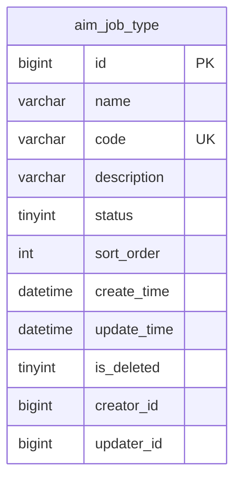

# 功能档案: 岗位类型管理

## 基本信息

| 属性 | 值 |
|------|-----|
| 功能ID | F-001 |
| 功能名称 | 岗位类型管理 |
| 所属服务 | mall-agent |
| 所属模块 | agent |
| 归档日期 | 2026-03-02 |
| 版本 | v1.0 |
| 状态 | active |
| 负责人 | AI Agent |

---

## 功能描述

### 业务背景

岗位类型是智能员工管理的基础数据，用于定义员工的岗位分类（如销售顾问、技术工程师、客服专员等）。系统需要支持岗位类型的增删改查，以及启用/禁用状态控制。

### 功能目标

1. 支持岗位类型的创建、查询、更新、删除
2. 支持岗位类型的启用/禁用状态控制
3. 返回关联员工数量统计（待实现）
4. 删除时校验是否有关联员工

### 用户故事

- 作为管理员，我想要创建岗位类型，以便为智能员工分配岗位
- 作为管理员，我想要启用/禁用岗位类型，以便控制岗位的可用性
- 作为管理员，我想要查看岗位类型的关联员工数，以便了解岗位使用情况

---

## 接口清单

### REST API 接口 (Inner API)

| 序号 | 接口名称 | HTTP方法 | 路径 | 调用方 | 说明 |
|------|----------|----------|------|--------|------|
| 1 | 岗位类型列表 | POST | /inner/api/v1/job-types/list | mall-admin/mall-app | 分页查询，支持关键词搜索 |
| 2 | 创建岗位类型 | POST | /inner/api/v1/job-types/create | mall-admin | 创建新岗位类型 |
| 3 | 更新岗位类型 | PUT | /inner/api/v1/job-types/update | mall-admin | 更新岗位信息 |
| 4 | 状态变更 | PUT | /inner/api/v1/job-types/status | mall-admin | 启用/禁用岗位 |
| 5 | 删除岗位类型 | DELETE | /inner/api/v1/job-types/delete | mall-admin | 删除（校验关联员工） |

### Feign 接口

| 序号 | 接口名称 | 提供方 | 消费方 | 说明 |
|------|----------|--------|--------|------|
| 1 | JobTypeRemoteService | mall-agent | mall-admin/mall-app | 岗位类型远程调用接口 |

---

## 核心类清单

### Controller 层

| 类名 | 路径 | 职责 | 接口数量 |
|------|------|------|----------|
| JobTypeInnerController | controller/inner/JobTypeInnerController.java | 内部API接口 | 5 |

### Service 层

| 类名 | 路径 | 职责 | 方法数量 |
|------|------|------|----------|
| JobTypeDomainService | service/JobTypeDomainService.java | 业务编排 | 6 |
| JobTypeQueryService | service/JobTypeQueryService.java | 查询服务 | 3 |
| JobTypeManageService | service/JobTypeManageService.java | 管理服务 | 4 |
| AimJobTypeService | service/mp/AimJobTypeService.java | 数据服务 | 3 |

### Mapper 层

| 类名 | 路径 | 职责 | SQL数量 |
|------|------|------|---------|
| AimJobTypeMapper | mapper/AimJobTypeMapper.java | 数据访问 | 3 |

### Domain 层

| 类名 | 路径 | 职责 | 说明 |
|------|------|------|------|
| AimJobTypeDO | domain/entity/AimJobTypeDO.java | 数据库实体 | 岗位类型实体 |
| JobTypeStatusEnum | domain/enums/JobTypeStatusEnum.java | 状态枚举 | 启用/禁用 |

### DTO 层

| 类名 | 路径 | 用途 | 字段数量 |
|------|------|------|----------|
| JobTypeCreateDTO | domain/dto/JobTypeCreateDTO.java | 创建参数 | 5 |
| JobTypeUpdateDTO | domain/dto/JobTypeUpdateDTO.java | 更新参数 | 5 |
| JobTypeStatusDTO | domain/dto/JobTypeStatusDTO.java | 状态更新 | 3 |
| JobTypePageQuery | domain/dto/JobTypePageQuery.java | 分页查询 | 3 |

---

## 数据库设计归档

> **说明**：本功能涉及的数据库表结构在此汇总。详细的表结构定义见 [Schema 归档](../../schemas/mall-agent/)。

### 本功能涉及的表

| 序号 | 表名 | 中文名 | 设计版本 | 设计需求 | 操作类型 | Schema 归档 |
|------|------|--------|----------|----------|----------|-------------|
| 1 | aim_job_type | 岗位类型表 | v1.0 | REQ-038 | 新增 | [链接](../../schemas/mall-agent/aim_job_type.md) |

### 表关系图

### 表设计要点

| 设计决策 | 说明 | 理由 |
|----------|------|------|
| 表名前缀 | aim_ | AI模块统一前缀 |
| 主键策略 | BIGINT AUTO_INCREMENT | 标准主键策略 |
| 软删除 | 是 | 保留历史数据 |
| 唯一约束 | code字段唯一 | 编码是业务标识 |
| 排序字段 | sort_order | 支持自定义排序 |

### 关键业务规则

- **编码规则**: 仅允许大写字母、数字、下划线
- **编码唯一**: 编码全局唯一，不可重复
- **状态控制**: 0-禁用，1-启用，默认启用
- **删除限制**: 有关联员工的岗位类型不可删除（待实现）
- **更新限制**: 编码字段不可修改

### 表结构快速参考

#### aim_job_type

| 字段名 | 类型 | 可空 | 默认值 | 说明 |
|--------|------|------|--------|------|
| id | BIGINT | NO | AUTO_INCREMENT | 主键 |
| name | VARCHAR(64) | NO | - | 岗位名称 |
| code | VARCHAR(32) | NO | - | 岗位编码（唯一） |
| description | VARCHAR(255) | YES | NULL | 岗位描述 |
| status | TINYINT | NO | 1 | 状态：0-禁用，1-启用 |
| sort_order | INT | NO | 0 | 排序号 |
| create_time | DATETIME | NO | CURRENT_TIMESTAMP | 创建时间 |
| update_time | DATETIME | NO | CURRENT_TIMESTAMP | 更新时间 |
| is_deleted | TINYINT | NO | 0 | 软删除标记 |
| creator_id | BIGINT | YES | NULL | 创建人ID |
| updater_id | BIGINT | YES | NULL | 更新人ID |

**索引**: uk_code(唯一), idx_status, idx_sort_order

**详细文档**: [../../schemas/mall-agent/aim_job_type.md](../../schemas/mall-agent/aim_job_type.md)

---

## 依赖关系

### 依赖的服务

| 服务 | 调用方式 | 接口数量 | 关键接口 |
|------|----------|----------|----------|
| mall-user | Feign | 待实现 | 员工数量统计 |

### 被依赖的服务

| 服务 | 调用方式 | 接口数量 | 关键接口 |
|------|----------|----------|----------|
| mall-admin | Feign | 5 | 岗位类型管理接口 |
| mall-app | Feign | 2 | 岗位类型查询接口 |

---

## 关键设计决策

### 决策1: 五层架构设计

**背景**: 需要清晰的职责分离和可维护的代码结构

**方案**: 采用 Controller → DomainService → Query/Manage Service → AimXxxService → AimXxxMapper 五层架构

**理由**:
1. 查询和写操作分离，便于优化和扩展
2. 业务编排集中在 DomainService
3. 数据访问统一封装在 AimXxxService

**影响**: 代码结构清晰，但增加了类的数量

### 决策2: 编码格式限制

**背景**: 需要统一的岗位编码格式，便于管理和识别

**方案**: 编码仅允许大写字母、数字、下划线（正则：^[A-Z0-9_]+$）

**理由**:
1. 统一格式，避免混乱
2. 适合作为系统标识
3. 便于前端展示和排序

**影响**: 限制了编码的灵活性，但提高了规范性

### 决策3: 员工数量统计待实现

**背景**: 岗位类型需要显示关联员工数量，但员工模块尚未完成

**方案**: 接口预留 employeeCount 字段，暂时返回0，添加 TODO 标记

**理由**:
1. 不阻塞岗位类型功能的交付
2. 接口契约确定，后续无需修改
3. 明确依赖关系（REQ-031）

**影响**: 功能不完整，需要后续迭代

---

## 测试用例

### HTTP 测试

| 接口 | 场景 | 文件路径 |
|------|------|----------|
| 岗位类型列表 | 分页查询、关键词搜索 | workspace/http-tests/inner-apis.http |
| 创建岗位类型 | 正常创建、参数校验失败 | workspace/http-tests/inner-apis.http |
| 更新岗位类型 | 正常更新、ID不存在 | workspace/http-tests/inner-apis.http |
| 状态变更 | 启用、禁用、无效状态 | workspace/http-tests/inner-apis.http |
| 删除岗位类型 | 正常删除、ID不存在 | workspace/http-tests/inner-apis.http |

---

## 注意事项

### 使用限制

- 编码一旦创建不可修改
- 删除操作会校验关联员工（待实现）
- 岗位类型数量预计小于1000条（小表）

### 后续优化建议

- 实现员工数量统计功能（依赖 REQ-031）
- 添加岗位类型缓存（如需要）
- 支持岗位类型批量导入/导出

---

## 变更历史

| 版本 | 日期 | 变更内容 | 变更人 |
|------|------|----------|--------|
| v1.0 | 2026-03-02 | 初始版本 | AI Agent |

---

## 相关文档

- 技术规格书: `workspace/tech-spec.md`
- 代码生成报告: `workspace/code-generation-report.md`
- 质量报告: `workspace/quality-report.md`
- 复用指南: `./reuse-guide.md`
