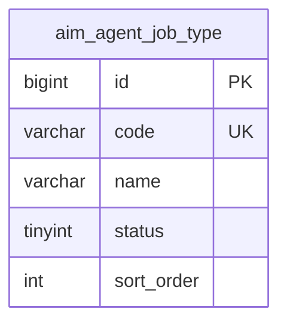

# mall-agent 数据库表结构

## 概述

本服务管理 AI 智能员工相关数据，包括岗位类型、员工信息等。

## 表列表

| 表名 | 中文名 | 说明 | 设计者 | 功能引用 |
|------------|--------------|-------------|-------------|-------------|
| aim_agent_job_type | 岗位类型表 | 岗位类型配置 | REQ-038 | F-001 |

## ER 图

## 命名约定

- **表前缀**: `aim_`（AI 模块）
- **主键**: `id`（BIGINT，AUTO_INCREMENT）
- **软删除**: `is_deleted`（TINYINT，0/1）
- **时间字段**: `create_time`、`update_time`（DATETIME）
- **操作人字段**: `creator_id`、`updater_id`（BIGINT）

## 变更历史

| 日期 | 变更 | 说明 |
|------|------|------|
| 2026-03-02 | 初始创建 | 添加 aim_agent_job_type 表 |
