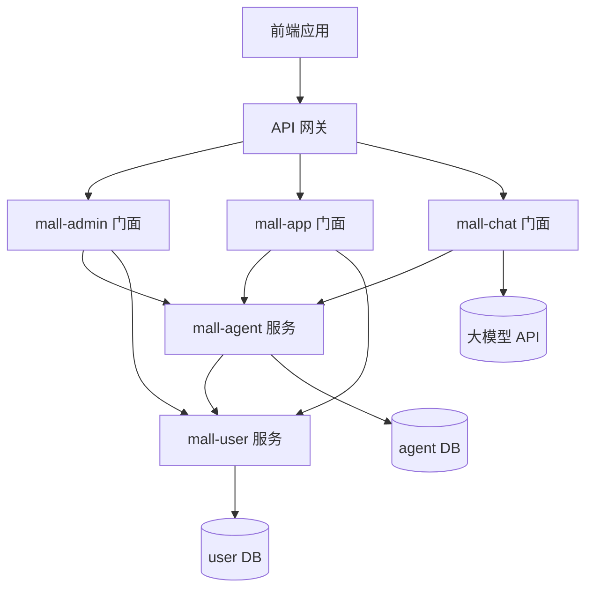

# 架构规范

本规范定义系统架构设计标准，包括分层架构、服务职责、接口风格、数据库设计等。

---

## 1. 分层架构

### 1.1 四层架构强制要求

必须严格遵循：**接口层 → 应用层 → 领域层 → 基础设施层**

```
┌─────────────────────────────────────┐
│           接口层 (Controller)         │  ← 接收请求、参数校验、返回响应
├─────────────────────────────────────┤
│           应用层 (Service)            │  ← 业务流程编排、事务管理
├─────────────────────────────────────┤
│           领域层 (Domain)             │  ← 业务逻辑、领域模型
├─────────────────────────────────────┤
│         基础设施层 (Mapper)           │  ← 数据访问、外部服务调用
└─────────────────────────────────────┘
```

**约束**：

- 禁止跨层直接调用，必须通过接口抽象
- 高层模块不依赖低层模块的具体实现
- 遵循依赖倒置原则

### 1.2 服务职责划分（五层架构）

| 层级             | 服务类型  | 命名规范                              | 职责                                | 调用规则                                       |
|----------------|-------|-----------------------------------|-----------------------------------|--------------------------------------------|
| **Controller** | 控制器   | `XxxController`                   | 接收请求，参数校验，调用业务域服务                 | 只能调用 XxxDomainService / XxxService         |
| **Domain**     | 业务域服务 | `XxxDomainService` / `XxxService` | 业务编排，协调查询和管理服务                    | 可调用 QueryService、ManageService             |
| **Query**      | 查询服务  | `XxxQueryService`                 | 只读查询，封装查询逻辑                       | **只能调用 AimXxxService**，禁止直接调用 AimXxxMapper |
| **Manage**     | 管理服务  | `XxxManageService`                | 增删改操作，封装写逻辑                       | **只能调用 AimXxxService**，禁止直接调用 AimXxxMapper |
| **Data**       | 数据服务  | `AimXxxService`                   | 继承 MyBatis-Plus IService，封装所有数据访问 | 可调用 AimXxxMapper 进行原生查询                    |
| **Data**       | 数据映射  | `AimXxxMapper`                    | 原生 MyBatis，复杂查询                   | 仅供 AimXxxService 调用                        |

**调用关系图**：

```
Controller
    ↓
XxxDomainService
    ↓
    ├── XxxQueryService ──→ AimXxxService ──→ AimXxxMapper (如需原生SQL)
    ↓
    └── XxxManageService ──→ AimXxxService ──→ AimXxxMapper (如需原生SQL)
```

**核心原则**：

- **XxxQueryService** 和 **XxxManageService** 只能依赖 `AimXxxService`
- **AimXxxService** 封装所有数据访问逻辑，包括 MP 分页和原生 Mapper 查询
- **AimXxxMapper** 只对 `AimXxxService` 暴露

### 1.3 模块类型设计规范

| 模块类型         | 路径前缀             | 说明           |
|--------------|------------------|--------------|
| **门面模块-管理端** | `/admin/api/v1/` | 供管理后台调用      |
| **门面模块-客户端** | `/app/api/v1/`   | 供 APP/商家端调用  |
| **服务模块**     | `/inner/api/v1/` | 供其他服务 RPC 调用 |

---

## 2. 服务架构

### 2.1 服务分层

```
前端应用
    ↓
┌─────────────┐
│  API 网关   │  （基础设施，由运维维护）
└─────────────┘
    ↓
┌─────────────┬─────────────┬─────────────┐
│  mall-admin │   mall-app  │  mall-chat  │  ← 门面服务层
│  (管理后台)  │   (客户端)   │ (AI对话)    │
└─────────────┴─────────────┴─────────────┘
    ↓                    ↓         ↓
    └──────────┬─────────┘         │
               ↓                   │
        ┌─────────────┐            │
        │  mall-agent │  ← 应用服务层（核心业务）
        │ (智能员工)   │            │
        └─────────────┘            │
               ↓                   │
        ┌─────────────┐            │
        │  mall-user  │  ← 支撑服务层
        │  (用户服务)  │            │
        └─────────────┘            │
               ↑                   │
               └───────────────────┘
```

### 2.2 服务调用规则

| 调用方                                 | 可调用       | 禁止调用      |
|-------------------------------------|-----------|-----------|
| 门面服务（mall-admin/mall-app/mall-chat） | 应用服务、支撑服务 | -         |
| 应用服务（mall-agent）                    | 支撑服务      | 门面服务      |
| 支撑服务（mall-user）                     | -         | 门面服务、应用服务 |

**特殊说明**：mall-chat 作为 AI 对话门面服务，可直接调用大模型 API，同时可调用 mall-agent 获取配置信息。

**所有跨服务调用必须通过 OpenFeign 实现。**

### 2.3 服务调用关系图



---

## 3. 接口风格规范

### 3.1 门面服务（mall-admin/mall-app）

- **职责**：对外暴露给前端的接口，负责参数校验和请求转发
- **风格**：完整 RESTful（GET/POST/PUT/DELETE 语义清晰）
- **路径**：
    - 管理端：`/admin/api/v1/{模块名}`
    - 客户端：`/app/api/v1/{模块名}`

**路径参数规范**：

- 允许使用路径参数，但**最多只有一个**
- 路径参数必须放在 URL 最后
- 推荐格式：`/resource/action/{id}`

### 3.2 应用服务（mall-agent/mall-user）

- **职责**：核心业务逻辑处理，供门面服务通过 Feign 调用
- **风格**：简化风格（仅 GET/POST）
    - GET：单参数查询
    - POST：多参数查询、创建、更新、删除（使用 @RequestBody 传递参数）
- **路径**：`/inner/api/v1/{模块名}`

**路径参数规范（Feign 调用）**：

- **禁止在 URL 中使用路径参数**
- 所有参数通过 Query 参数或 RequestBody 传递
- 查询类：使用 Query 参数（GET 请求）
- 操作类：使用 RequestBody（POST 请求）

### 3.3 调用关系

```
前端 → 门面服务（参数校验）→ Feign → 应用服务（业务逻辑）
```

**关键约束**：

- 前端**禁止**直接调用应用服务
- 参数必要性校验在门面层完成
- 应用服务专注业务逻辑，信任门面层已做基础校验

### 3.4 API 路径参数规范对比

| 层级  | 路径参数 | 示例                                           |
|-----|------|----------------------------------------------|
| 门面层 | 允许一个 | `GET /admin/api/v1/agent/{id}`               |
| 应用层 | 禁止   | `GET /inner/api/v1/agent/detail?agentId=xxx` |

---

## 4. 数据访问与分页规范

### 4.1 MyBatis-Plus 使用规范

#### 增删改操作（ManageService）

**推荐直接使用 MyBatis-Plus IService**：

```java

@Service
@RequiredArgsConstructor
public class JobTypeManageService {

    private final AimJobTypeService aimJobTypeService;

    public Long createJobType(JobTypeCreateDTO dto) {
        AimJobTypeDO entity = new AimJobTypeDO();
        // ... 设置字段
        aimJobTypeService.save(entity);
        return entity.getId();
    }

    public boolean updateJobType(JobTypeUpdateDTO dto) {
        AimJobTypeDO entity = aimJobTypeService.getById(dto.getId());
        // ... 更新字段
        return aimJobTypeService.updateById(entity);
    }

    public boolean deleteJobType(Long id) {
        return aimJobTypeService.removeById(id);
    }
}
```

#### 查询操作（QueryService）

**小表分页查询**（预估数据量 < 100万）：

```java

@Service
@RequiredArgsConstructor
public class JobTypeQueryService {

    private final AimJobTypeService aimJobTypeService;

    public Page<AimJobTypeDO> pageJobType(JobTypePageQuery query) {
        LambdaQueryWrapper<AimJobTypeDO> wrapper = new LambdaQueryWrapper<>();

        if (StringUtils.isNotBlank(query.getKeyword())) {
            wrapper.like(AimJobTypeDO::getName, query.getKeyword())
                    .or()
                    .like(AimJobTypeDO::getDescription, query.getKeyword());
        }

        wrapper.orderByAsc(AimJobTypeDO::getSortOrder);

        return aimJobTypeService.page(
                new Page<>(query.getPageNum(), query.getPageSize()),
                wrapper
        );
    }
}
```

**大表分页查询**（预估数据量 >= 100万）：

**索引覆盖分页（避免深分页回表）**

```java

@Service
@RequiredArgsConstructor
public class OrderQueryService {

    private final AimOrderService aimOrderService;

    /**
     * 索引覆盖分页 - 先查ID，再批量查数据
     */
    public Page<AimOrderDO> pageByCoveringIndex(OrderPageQuery query) {
        // 只能调用 AimOrderService，不直接调用 AimOrderMapper
        return aimOrderService.pageByCoveringIndex(query.getPageNum(), query.getPageSize());
    }
}

@Service
public class AimOrderService extends ServiceImpl<AimOrderMapper, AimOrderDO> {

    /**
     * 索引覆盖分页实现 - 内部调用 AimOrderMapper
     */
    public Page<AimOrderDO> pageByCoveringIndex(Integer pageNum, Integer pageSize) {
        int offset = (pageNum - 1) * pageSize;

        // 第一步：只从索引查ID（很快）
        List<Long> ids = baseMapper.selectIdsByPage(offset, pageSize);

        if (ids.isEmpty()) {
            return new Page<>(pageNum, pageSize);
        }

        // 第二步：用ID批量查询（走主键索引）
        List<AimOrderDO> records = baseMapper.selectBatchByIds(ids);

        // 获取总数（可缓存）
        Long total = baseMapper.selectCount(null);

        Page<AimOrderDO> page = new Page<>(pageNum, pageSize, total);
        page.setRecords(records);
        return page;
    }
}
```

```xml
<!-- AimOrderMapper.xml -->
<!-- 先只查ID（走索引，不回表） -->
<select id="selectIdsByPage" resultType="java.lang.Long">
    SELECT id FROM aim_order
    WHERE is_deleted = 0
    ORDER BY id DESC
    LIMIT #{offset}, #{limit}
</select>

        <!-- 再用ID批量查询（走主键索引） -->
<select id="selectBatchByIds" resultType="com.aim.mall.agent.domain.entity.AimOrderDO">
SELECT
<include refid="Base_Column_List"/>
FROM
<include refid="Base_Table"/>
WHERE id IN
<foreach collection="ids" item="id" open="(" separator="," close=")">
    #{id}
</foreach>
ORDER BY FIELD(id,
<foreach collection="ids" item="id" separator=",">#{id}</foreach>
)
</select>
```

**非分页查询**：

```java

@Service
@RequiredArgsConstructor
public class JobTypeQueryService {

    private final AimJobTypeService aimJobTypeService;

    // ✅ 使用 AimJobTypeService 封装的原生查询
    public AimJobTypeDO getByCode(String code) {
        return aimJobTypeService.getByCode(code);
    }
}

@Service
public class AimJobTypeService extends ServiceImpl<AimJobTypeMapper, AimJobTypeDO> {

    // AimJobTypeService 内部调用 AimJobTypeMapper
    public AimJobTypeDO getByCode(String code) {
        return baseMapper.selectByCode(code);
    }
}
```

### 4.2 分页方案选择指南

| 场景        | 数据量预估    | 推荐方案                  | 说明           |
|-----------|----------|-----------------------|--------------|
| **小表分页**  | < 100万条  | MyBatis-Plus `page()` | 简单高效         |
| **大表分页**  | >= 100万条 | 索引覆盖分页                | 避免回表，有 total |
| **非分页查询** | 任意       | 原生 MyBatis XML        | 性能可控         |

### 4.3 分页接口设计规范

**接口设计时预估数据量**：

```java
/**
 * 岗位类型列表
 *
 * 数据量预估：预计 < 1000 条（小表）
 * 分页方案：MyBatis-Plus 分页
 */
@GetMapping
public CommonResult<CommonResult.PageData<JobTypeResponse>> pageJobType(...) {
    // ...
}

/**
 * 订单列表
 *
 * 数据量预估：预计 > 1000万条（大表）
 * 分页方案：索引覆盖分页
 */
@GetMapping("/orders")
public CommonResult<CommonResult.PageData<OrderResponse>> pageOrder(...) {
    // ...
}
```

**ORDER BY 字段必须有索引**：

```sql
-- ✅ 有索引的排序
CREATE INDEX idx_sort_order ON aim_job_type (sort_order, create_time);

-- ✅ 主键排序（默认有索引）
ORDER BY id
DESC

-- ❌ 无索引排序（全表扫描+文件排序）
    ORDER BY create_time DESC -- 如果 create_time 没有索引
```

---

## 5. 数据库设计规范

### 4.1 通用字段规范

所有业务表必须包含以下通用字段：

| 字段名           | 类型       | 约束                                                    | 说明                  |
|---------------|----------|-------------------------------------------------------|---------------------|
| `id`          | BIGINT   | PRIMARY KEY AUTO_INCREMENT                            | 主键，自增               |
| `create_time` | DATETIME | DEFAULT CURRENT_TIMESTAMP                             | 创建时间                |
| `update_time` | DATETIME | DEFAULT CURRENT_TIMESTAMP ON UPDATE CURRENT_TIMESTAMP | 更新时间，自动更新           |
| `is_deleted`  | TINYINT  | DEFAULT 0                                             | 逻辑删除标记（0-未删除，1-已删除） |
| `creator_id`  | BIGINT   | NULLABLE                                              | 创建人ID（可选）           |
| `updater_id`  | BIGINT   | NULLABLE                                              | 更新人ID（可选）           |

### 4.2 数据类型选择规范

| 数据类别       | 推荐类型       | 使用场景                     |
|------------|------------|--------------------------|
| **布尔值**    | TINYINT(1) | 0 表示 false，1 表示 true     |
| **小范围整数**  | TINYINT    | -128~127，如状态码（0-禁用，1-启用） |
| **中等范围整数** | SMALLINT   | -32768~32767             |
| **常规整数**   | INT        | -21亿~21亿                 |
| **大整数**    | BIGINT     | 主键、用户ID、金额计算等            |
| **短字符串**   | VARCHAR(n) | 名称、编码等，根据实际长度指定 n        |
| **大文本**    | TEXT       | 描述、JSON 配置、长文本内容         |
| **日期时间**   | DATETIME   | 无时区要求的日期时间（推荐）           |
| **时间戳**    | TIMESTAMP  | 需要自动时区转换的场景              |

### 4.3 字符集规范

- **默认字符集**：`DEFAULT CHARSET=utf8mb4`
- **排序规则**：**禁止指定具体的 COLLATE**，使用数据库默认排序规则

### 4.4 建表示例

```sql
CREATE TABLE agent
(
    id          BIGINT PRIMARY KEY AUTO_INCREMENT COMMENT '主键ID',
    -- 业务字段
    name        VARCHAR(100) NOT NULL COMMENT '智能员工名称',
    status      TINYINT  DEFAULT 1 COMMENT '状态：0-禁用 1-启用',
    config      JSON COMMENT '配置信息',
    -- 通用字段
    create_time DATETIME DEFAULT CURRENT_TIMESTAMP COMMENT '创建时间',
    update_time DATETIME DEFAULT CURRENT_TIMESTAMP ON UPDATE CURRENT_TIMESTAMP COMMENT '更新时间',
    is_deleted  TINYINT  DEFAULT 0 COMMENT '逻辑删除标记：0-未删除 1-已删除',
    creator_id  BIGINT COMMENT '创建人ID',
    updater_id  BIGINT COMMENT '更新人ID',
    -- 索引
    INDEX idx_status (status),
    INDEX idx_create_time (create_time)
) COMMENT '智能员工表'
    DEFAULT CHARSET = utf8mb4;
```

### 4.5 DO 类命名规范

严格按表名转换为大驼峰 + DO 后缀：

| 表名                 | DO 类名              |
|--------------------|--------------------|
| `agent`            | `AimAgentDO`       |
| `agent_skill`      | `AgentSkillDO`     |
| `aim_product_info` | `AimProductInfoDO` |

---

## 5. Feign 接口规范

### 5.1 Feign 客户端定义规范

#### 命名规范

**Feign 客户端命名**：`{模块名}RemoteService`

- 位于 `mall-{模块}-api` 模块的 `api/feign/` 包下
- 统一使用 `RemoteService` 后缀，替代 `FeignClient` 后缀
- 示例：`AgentRemoteService` (对应 mall-agent-api), `UserRemoteService` (对应 mall-user-api)

#### 接口定义规范

- 查询类：使用 Query 参数，**禁止路径参数**
- 操作类：使用 RequestBody

### 5.2 Feign 调用方使用

- 参数校验（门面层负责）
- 转换为 DTO
- 调用应用服务

---

## 6. API 模块规范（mall-{模块}-api）

### 6.1 设计原则

**独立 API 模块**：每个业务模块提供独立的 API 模块（`mall-{模块}-api`），统一放在 `repos/mall-inner-api` 目录下，供其他服务引用。

**目的**：

- 解耦服务间调用接口
- 避免被调用服务暴露内部实现
- 统一管理和版本控制远程调用接口
- 集中管理所有内部服务间调用的 API 定义

### 6.2 目录结构

所有 API 模块统一放在 `repos/mall-inner-api/` 目录下：

```
repos/mall-inner-api/
├── mall-agent-api/                      # 智能员工模块 API
│   ├── src/main/java/com/aim/mall/agent/
│   │   └── api/
│   │       ├── dto/
│   │       │   ├── request/             # 远程调用请求参数
│   │       │   │   ├── JobTypeCreateApiRequest.java
│   │       │   │   ├── JobTypeUpdateApiRequest.java
│   │       │   │   ├── JobTypePageApiRequest.java
│   │       │   │   └── JobTypeStatusApiRequest.java
│   │       │   └── response/            # 远程调用返回值
│   │       │       └── JobTypeApiResponse.java
│   │       ├── enums/                   # 远程接口使用的枚举
│   │       │   └── JobTypeStatusEnum.java
│   │       └── feign/                   # Feign 客户端
│   │           └── AgentRemoteService.java
│   └── pom.xml
├── mall-user-api/                       # 用户模块 API
│   └── ...
└── pom.xml                              # 父 POM
```

### 6.3 使用方式

**调用方**（如 mall-admin）引用 API 模块：

```xml
<!-- mall-admin/pom.xml -->
<dependency>
    <groupId>com.aim.mall</groupId>
    <artifactId>mall-agent-api</artifactId>
    <version>${project.version}</version>
</dependency>
```

```java
// mall-admin 中的调用
@Service
@RequiredArgsConstructor
public class JobTypeAdminService {

    private final JobTypeRemoteService jobTypeRemoteService;  // 来自 mall-agent-api

    public JobTypeResponse getJobType(Long id) {
        // 使用 API 模块中的 Request/Response
        return jobTypeRemoteService.getJobTypeById(id).getData();
    }
}
```

### 6.4 被调用方（mall-agent）的变化

**删除被调用服务的 `api/` 目录**：

```
mall-agent/                              # 被调用服务
├── src/main/java/com/aim/mall/
│   ├── agent/                           # 业务模块
│   │   ├── controller/
│   │   │   └── inner/
│   │   │       └── JobTypeInnerController.java   # 实现 API 接口
│   │   ├── service/
│   │   │   ├── JobTypeDomainService.java
│   │   │   ├── JobTypeQueryService.java
│   │   │   ├── JobTypeManageService.java
│   │   │   └── mp/
│   │   │       └── AimJobTypeService.java
│   │   ├── mapper/
│   │   │   └── AimJobTypeMapper.java
│   │   └── domain/
│   │       ├── entity/
│   │       ├── dto/                     # 内部 DTO，不对外暴露
│   │       ├── enums/                   # 内部枚举，不对外暴露
│   │       └── exception/
│   ├── config/                          # 全局配置（共享）
│   │   └── FeignConfig.java
│   └── constants/                       # 全局常量（共享）
└── pom.xml
```

**规范说明**：

- mall-agent 不再包含 `api/` 目录，所有对外接口定义在 `mall-agent-api` 模块中
- `config/` 和 `constants/` 位于 `com.aim.mall` 包下，与 `agent/` 同级，可被其他模块共享

### 6.5 门面服务的特殊处理

**门面服务（mall-admin/mall-app）的 Request/Response**：

由于门面服务的 Request/Response **仅用于前端交互，不被其他模块引用**，因此放在本地 `domain/dto/` 中：

```
mall-admin/
├── src/main/java/com/aim/mall/
│   ├── admin/                             # 业务模块
│   │   ├── controller/
│   │   │   └── JobTypeAdminController.java    # 使用本地的 Request/Response
│   │   └── domain/
│   │       └── dto/
│   │           ├── request/               # 前端请求参数（本地使用）
│   │           │   ├── JobTypeCreateRequest.java
│   │           │   └── JobTypeUpdateRequest.java
│   │           └── response/              # 前端返回值（本地使用）
│   │               └── JobTypeVO.java     # 门面服务可定义 VO
│   ├── config/                            # 全局配置（共享）
│   └── constants/                         # 全局常量（共享）
└── pom.xml
```

**重要规范**：门面服务 **禁止相互调用**，因此门面服务中 **不存在 feign 目录**

### 6.6 对象归属总结

| 对象类型               | 门面服务 (mall-admin)            | 应用服务 (mall-agent)   | API 模块 (mall-agent-api) |
|--------------------|------------------------------|---------------------|-------------------------|
| **前端 Request**     | `admin/domain/dto/request/`  | -                   | -                       |
| **前端 Response/VO** | `admin/domain/dto/response/` | -                   | -                       |
| **远程 Request**     | 引用 API 模块                    | -                   | `api/dto/request/`      |
| **远程 Response**    | 引用 API 模块                    | -                   | `api/dto/response/`     |
| **RemoteService**  | 引用 API 模块                    | -                   | `api/feign/`            |
| **远程枚举**           | 引用 API 模块                    | -                   | `api/enums/`            |
| **内部 DTO**         | `admin/domain/dto/`          | `agent/domain/dto/` | -                       |
| **全局配置**           | `config/` (共享)               | `config/` (共享)      | -                       |
| **全局常量**           | `constants/` (共享)            | `constants/` (共享)   | -                       |
| **内部枚举**           | `domain/enums/`              | `domain/enums/`     | -                       |

### 6.7 命名约束

**Controller 层强制约束**：

- 请求参数必须以 `Request` 结尾（如 `JobTypeCreateRequest`）
- 返回参数必须以 `Response` 或 `VO` 结尾（如 `JobTypeResponse`、`JobTypeVO`）
- **禁止**使用 `Query`、`DTO` 作为 Controller 参数/返回类型后缀

**Service 层内部约束**：

- 分页查询参数以 `PageQuery` 结尾（如 `JobTypePageQuery`）
- 列表查询参数以 `ListQuery` 结尾（如 `JobTypeListQuery`）
- 普通查询参数以 `Query` 结尾（如 `AgentQuery`）
- 返回以 `DTO` 结尾（如 `JobTypeDTO`）
- **禁止**使用 `Request`、`Response` 作为内部 Service 参数/返回类型后缀

**命名区分规则**：

门面服务调用远程服务时，通过命名后缀区分本地和远程对象：

| 对象类型 | 门面服务（本地）      | 远程服务（API模块）      | 命名示例                                                   |
|------|---------------|------------------|--------------------------------------------------------|
| 请求参数 | `XxxRequest`  | `XxxApiRequest`  | 本地：`JobTypeCreateRequest`，远程：`JobTypeCreateApiRequest` |
| 返回响应 | `XxxResponse` | `XxxApiResponse` | 本地：`JobTypeResponse`，远程：`JobTypeApiResponse`           |

**命名策略**：

- 远程服务对象统一添加 `Api` 后缀（如 `JobTypeCreateApiRequest`）
- 本地服务对象保持标准命名（如 `JobTypeCreateRequest`）
- VO 仅用于复杂对象聚合场景，不作为区分手段

---

## 7. 代码结构示例

### 7.1 门面服务（mall-admin/mall-app）

门面服务（Facade Service）是直接面向前端的服务，接收前端 HTTP 请求，可调用多个应用服务聚合数据。

```
mall-admin/src/main/java/com/aim/mall/
├── admin/                               # 业务模块
│   ├── controller/
│   │   └── AgentAdminController.java    # 管理后台接口
│   └── domain/
│       └── dto/
│           ├── request/
│           │   └── AgentListRequest.java    # 查询请求
│           ├── response/
│           │   └── AgentResponse.java       # 简单响应
│           └── vo/
│               └── AgentDetailVO.java       # 复杂响应（聚合多个Response）
├── config/                              # 全局配置（共享）
└── constants/                           # 全局常量（共享）
```

**注意**：门面服务禁止相互调用，因此不存在 feign 目录

**门面服务特点**：

- **直接面向前端**：接收前端 HTTP 请求，路径前缀 `/admin/api/v1/` 或 `/app/api/v1/`
- **允许使用 VO**：当需要聚合多个应用服务的数据时，使用 VO 包装多个 Response
- **参数传递灵活**：GET 请求可使用多个 `@RequestParam`，POST 请求使用 `@RequestBody`
- **无 Service 层**：Controller 直接调用 Feign 客户端

### 6.2 应用服务/支撑服务（mall-agent/mall-user）

应用服务（Application Service）是后端内部服务，通过 Feign 供门面服务调用，**不直接面向前端**。

```
mall-agent/src/main/java/com/aim/mall/
├── agent/                               # 业务模块
│   ├── controller/
│   │   ├── AgentController.java         # 对外接口（如有）
│   │   └── inner/
│   │       └── AgentInnerController.java # 内部 Feign 接口
│   ├── service/
│   │   ├── AgentDomainService.java      # 业务域服务（业务编排）
│   │   ├── AgentQueryService.java       # 查询服务（只读）
│   │   ├── AgentManageService.java      # 管理服务（增删改）
│   │   └── mp/                          # MyBatis-Plus 数据服务
│   │       └── AimAgentService.java     # 继承 IService<AimAgentDO>
│   ├── mapper/
│   │   └── AimAgentMapper.java          # 原生 MyBatis
│   └── domain/
│       ├── entity/
│       │   └── AimAgentDO.java          # 数据库实体
│       ├── dto/
│   │       ├── AgentListApiRequest.java   # 查询参数（Controller入参转换）
│   │       └── AgentCreateDTO.java        # 创建DTO
│   │   ├── enums/
│   │   │   └── AgentStatusEnum.java
│   │   └── exception/
│   │       └── AgentDomainException.java
│   └── api/
│       └── dto/
│           ├── request/
│           │   └── AgentCreateApiRequest.java  # 仅Controller入参
│           └── response/
│               └── AgentApiResponse.java       # Controller出参
├── config/                              # 全局配置（共享）
│   └── FeignConfig.java
└── constants/                           # 全局常量（共享）
```

**应用服务特点**：

- **不直接面向前端**：仅供内部服务间调用，路径前缀 `/inner/api/v1/`
- **参数封装严格**：只有当请求参数 ≤2 个且为基础类型时，才使用 `@RequestParam`；否则一律使用 `@RequestBody` 封装
- **无 VO 概念**：直接返回 Response，不包装 VO
- **五层架构**：Controller → DomainService → Query/Manage Service → AimXxxService → AimXxxMapper
- **InnerController 职责**：参数转换（Query/DTO），直接转发 Service 结果
- **Response 复用**：供 Feign 调用方（门面服务）复用
- **SQL 规范**：SQL 统一放在 XML 中，禁止在 Mapper 注解中写复杂 SQL
- **数据访问分层**：
    - **XxxQueryService / XxxManageService**：只能调用 `AimXxxService`，禁止直接调用 `AimXxxMapper`
    - **AimXxxService**（`service/mp/`）：继承 MyBatis-Plus IService，封装所有数据访问（MP 分页/CRUD + 原生 Mapper 调用）
    - **AimXxxMapper**：原生 MyBatis XML，只对 `AimXxxService` 暴露

---

## 8. 门面服务 vs 应用服务对比

### 8.1 术语定义

| 术语       | 英文                  | 定义                                        | 调用方         |
|----------|---------------------|-------------------------------------------|-------------|
| **门面服务** | Facade Service      | 直接面向前端（浏览器/APP）的服务，接收 HTTP 请求，可聚合多个应用服务数据 | 前端应用        |
| **应用服务** | Application Service | 后端内部服务，通过 Feign 供门面服务或其他应用服务调用            | 门面服务、其他应用服务 |
| **支撑服务** | Support Service     | 提供基础能力（如用户服务）的应用服务                        | 应用服务        |

### 8.2 核心差异对比

| 特性           | 门面服务（Facade）                            | 应用服务（Application）                       |
|--------------|-----------------------------------------|-----------------------------------------|
| **调用来源**     | 前端（浏览器/APP）                             | 内部服务（Feign）                             |
| **路径前缀**     | `/admin/api/v1/` `/app/api/v1/`         | `/inner/api/v1/`                        |
| **参数传递**     | 灵活：GET+多RequestParam 或 POST+RequestBody | 严格：≤2个基础类型用RequestParam，否则一律RequestBody |
| **返回类型**     | Response 或 VO（可聚合多个Response）            | 仅 Response（不包装VO）                       |
| **Service层** | 无，直接调用Feign                             | 有，包含业务逻辑+DO转Response                    |
| **VO使用**     | ✅ 允许（聚合多个Response）                      | ❌ 禁止                                    |

### 8.3 参数传递规则详解

#### 门面服务参数规则

```java
// ✅ GET + 多个 RequestParam（适合简单查询）
@GetMapping("/list")
public CommonResult<CommonResult.PageData<AgentApiResponse>> pageAgent(
        @RequestParam(name = "keyword", required = false) String keyword,
        @RequestParam(name = "status", required = false) Integer status,
        @RequestParam(name = "pageNum", defaultValue = "1") Integer pageNum,
        @RequestParam(name = "pageSize", defaultValue = "10") Integer pageSize) {
    return agentFeignClient.pageAgent(keyword, status, pageNum, pageSize);
}

// ✅ POST + RequestBody（适合复杂查询或多参数）
@PostMapping("/search")
public CommonResult<CommonResult.PageData<AgentApiResponse>> pageAgent(
        @RequestBody @Valid AgentListApiRequest request) {
    return agentFeignClient.pageAgent(request);
}
```

#### 应用服务参数规则

```java
// ✅ 参数 ≤2 个且为基础类型：使用 RequestParam
@GetMapping("/detail")
public CommonResult<AgentApiResponse> getAgentById(
        @RequestParam("agentId") Long agentId) {
    return agentService.getById(agentId);
}

// ✅ 参数 >2 个或包含对象：一律使用 RequestBody
@PostMapping("/list")
public CommonResult<CommonResult.PageData<AgentApiResponse>> pageAgent(
        @RequestBody @Valid AgentListApiRequest request) {
    return agentService.pageAgent(request);
}

// ❌ 错误：参数超过2个仍使用 RequestParam
@GetMapping("/list")
public CommonResult<CommonResult.PageData<AgentApiResponse>> pageAgent(
        @RequestParam(name = "keyword", required = false) String keyword,
        @RequestParam(name = "status", required = false) Integer status,
        @RequestParam(name = "pageNum", defaultValue = "1") Integer pageNum,
        @RequestParam(name = "pageSize", defaultValue = "10") Integer pageSize) {
    // 错误！应该封装成 RequestBody
}
```

### 8.4 VO 使用场景（仅门面服务）

当门面服务需要聚合多个应用服务的数据时，使用 VO 包装：

```java
// 应用服务返回的 Response（远程服务）
public class AgentApiResponse { ...
}

public class UserApiResponse { ...
}

// 门面服务本地的 Response（从 ApiResponse 转换而来）
public class AgentResponse { ...
}

public class UserResponse { ...
}

// 门面服务的 VO（聚合多个本地 Response）
@Data
public class AgentDetailVO implements Serializable {
    private AgentResponse agent;           // 智能员工信息（本地 Response）
    private UserResponse creator;          // 创建者信息（本地 Response）
    private List<SkillResponse> skills;    // 技能列表（本地 Response）
    private Integer sessionCount;          // 会话数量统计
}

// 门面服务 Controller
@GetMapping("/{agentId}/detail")
public CommonResult<AgentDetailVO> getAgentDetail(@PathVariable("agentId") Long agentId) {
    // 调用多个 Feign 客户端获取远程 ApiResponse
    AgentApiResponse agentApi = agentFeignClient.getById(agentId).getData();
    UserApiResponse creatorApi = userFeignClient.getById(agentApi.getCreatorId()).getData();
    List<SkillApiResponse> skillsApi = skillFeignClient.listByAgentId(agentId).getData();
    Integer sessionCount = sessionFeignClient.countByAgentId(agentId).getData();

    // 转换为本地 Response
    AgentResponse agent = convertToAgentResponse(agentApi);
    UserResponse creator = convertToUserResponse(creatorApi);
    List<SkillResponse> skills = skillsApi.stream()
            .map(this::convertToSkillResponse)
            .collect(Collectors.toList());

    // 组装 VO
    AgentDetailVO vo = new AgentDetailVO();
    vo.setAgent(agent);
    vo.setCreator(creator);
    vo.setSkills(skills);
    vo.setSessionCount(sessionCount);

    return CommonResult.success(vo);
}
```

---

## 9. 检查清单

### 架构设计检查

- [ ] 遵循四层架构（接口层→应用层→领域层→基础设施层）
- [ ] 服务职责划分清晰（QueryService/ManageService/DomainService）
- [ ] 模块类型区分正确（门面模块/服务模块）
- [ ] 服务调用关系符合规范

### 接口设计检查

- [ ] 门面服务使用 RESTful 风格（GET/POST/PUT/DELETE）
- [ ] 应用服务使用简化风格（仅 GET/POST）
- [ ] 门面层路径参数最多一个
- [ ] 应用层禁止路径参数（使用 Query 或 RequestBody）

### 数据库设计检查

- [ ] 包含所有通用字段（id、create_time、update_time、is_deleted 等）
- [ ] 数据类型选择符合规范
- [ ] 字符集为 utf8mb4
- [ ] 不指定 COLLATE
- [ ] DO 类命名符合规范（大驼峰+DO 后缀）

### Feign 接口检查

- [ ] 查询类使用 Query 参数
- [ ] 操作类使用 RequestBody
- [ ] 禁止路径参数

---

## 相关文档

- **代码生成模板**：`.qoder/skills/java-code-generation.md`
- **编码规范**：`.qoder/rules/04-coding-standards.md`
