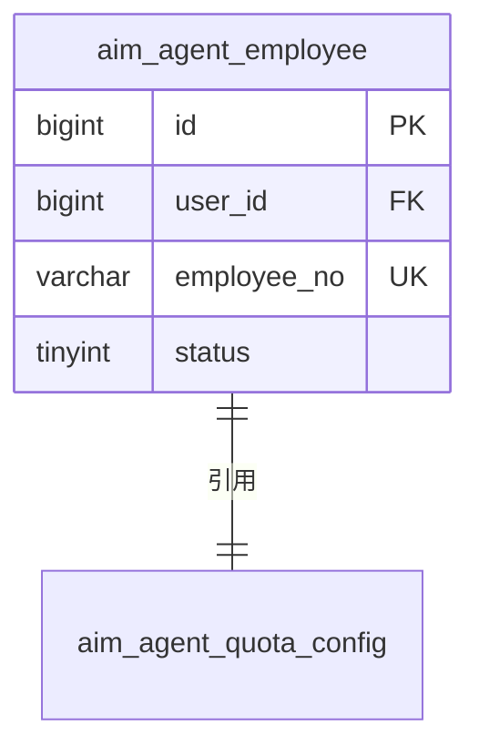
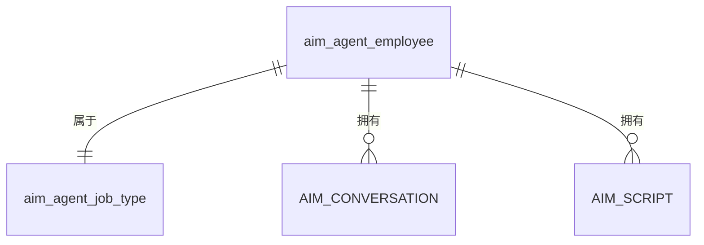

# 功能归档 Skill

将已完成的功能归档到 `.qoder/repowiki/features/`，用于未来开发参考和复用。此 Skill 还处理数据库表结构归档到 `.qoder/repowiki/schemas/`。

---

## 触发条件

- 功能实现完成
- 用户指令："归档功能" 或 "委托：归档功能"
- 实现 Program 的标准工作流最终任务
- 数据库表设计完成需要归档

---

## 输入

- 实现 Program 工作区：
  - `tech-spec.md` — 技术规格书（包含数据模型设计）
  - `answers.md` — 需求澄清结果
  - `decisions.md` — 技术决策记录
  - `repos/` 中的源代码（实体类、DDL 文件）
- 当前 Program ID 和 REQ ID
- 本功能设计的数据库表

---

## 输出

### 功能归档

- 功能归档 → `.qoder/repowiki/features/F-{seq}-{name}/`
  - `archive.md` — 功能描述、接口列表、核心类、设计决策、**数据库表结构**
  - `reuse-guide.md` — 如何复用此功能
  - `snippets/` — 可复用代码片段

### 数据库表结构归档

- 表结构归档 → `.qoder/repowiki/schemas/{service}/{table-name}.md`
- 服务概览 → `.qoder/repowiki/schemas/{service}/_service-overview.md`
- 表结构索引 → `.qoder/repowiki/schemas/index.md`

---

## 归档结构

```
.qoder/repowiki/
├── features/                   # 功能归档
│   ├── index.md
│   ├── _TEMPLATE/
│   │   ├── feature-template.md   # 功能归档模板
│   │   └── reuse-guide.md        # 复用指南模板
│   ├── F-001-create-agent/
│   │   ├── archive.md            # 功能归档（包含数据库表结构章节）
│   │   ├── reuse-guide.md
│   │   └── snippets/
│   └── F-002-job-type/
│       └── ...
│
└── schemas/                    # 数据库表结构归档
    ├── index.md
    ├── _TEMPLATE/
    │   ├── schema-template.md    # 表结构归档模板
    │   └── _service-overview.md  # 服务概览模板
    ├── mall-agent/              # 服务级表结构目录
    │   ├── _service-overview.md   # 服务表结构概览
    │   ├── aim_agent_employee.md
    │   ├── aim_agent_job_type.md
    │   └── ...
    ├── mall-user/
    │   ├── _service-overview.md
    │   └── aim_user.md
    └── ...
```

---

## 工作流程

### 阶段 1：功能归档

#### 步骤 1：读取源文档

1. 读取 tech-spec.md（提取数据模型章节）
2. 读取 answers.md
3. 读取 decisions.md
4. 读取关键源文件（实体类、Mapper 文件）
5. 检查现有功能索引

#### 步骤 2：生成归档 ID

生成功能 ID：`F-{sequence:000}-{feature-name}`

示例：`F-001-create-agent`

#### 步骤 3：创建归档目录

```bash
mkdir -p .qoder/repowiki/features/F-xxx-{name}/snippets
```

#### 步骤 4：提取数据库表结构信息

从 tech-spec.md 和源代码中提取：
- 本功能设计的表名
- 实体类定义（字段、类型、约束）
- 索引定义
- 表关系
- DDL 语句（如果有）

#### 步骤 5：生成 archive.md

```markdown
---
feature_id: F-001
feature_name: 智能员工创建
program: P-2026-001-REQ-031
description: 创建智能员工，包含校验和配额检查
service: mall-agent
created_at: 2026-02-28
tags: [employee, creation, validation]
---

# F-001: 智能员工创建

## 概述

功能的简要描述。

## 接口

| 接口 | 路径 | 方法 | 说明 |
|-----------|------|--------|-------------|
| 创建 | /inner/api/v1/ai-employee/create | POST | 创建智能员工 |

## 核心类

| 类 | 类型 | 说明 |
|-------|------|-------------|
| AiEmployeeService | Service | 业务逻辑 |
| AimEmployeeDO | Entity | 数据库实体 |

## 数据库表结构

### 设计的表

| 表名 | 说明 | 设计 REQ | 归档位置 |
|------------|-------------|------------|------------------|
| aim_agent_employee | 智能员工主表 | REQ-031 | schemas/mall-agent/aim_agent_employee.md |
| aim_agent_quota_config | 配额配置表 | REQ-032 | schemas/mall-agent/aim_agent_quota_config.md |

### 表关系



### 关键设计决策

- **表命名**：AI 模块表使用 `aim_` 前缀
- **主键**：所有表使用 BIGINT AUTO_INCREMENT
- **软删除**：使用 `is_deleted` 字段 + 带删除标志的唯一索引

## 设计决策

### 决策 1：XXX
- **背景**：为什么做这个决策
- **决策**：决定了什么
- **理由**：为什么选择这个方案

## 复用指南

参见 [reuse-guide.md](./reuse-guide.md)
```

#### 步骤 6：生成 reuse-guide.md

```markdown
# 复用指南：智能员工创建

## 何时复用

- 创建类似的员工/智能体实体
- 需要校验 + 配额检查模式

## 关键组件

1. **校验模式**：参见 snippets/ValidationPattern.java
2. **配额检查**：参见 snippets/QuotaCheck.java

## 数据库表结构复用

### 表结构参考

参见 [schemas/mall-agent/aim_agent_employee.md](../schemas/mall-agent/aim_agent_employee.md)

### 适配点

| 原始 | 适配为 | 说明 |
|----------|----------|-------|
| AiEmployee | XxxEntity | 修改实体名 |
| employeeQuota | xxxQuota | 修改配额字段 |
| aim_agent_employee | aim_xxx | 修改表名 |

## 代码片段

参见 `snippets/` 目录。
```

#### 步骤 7：提取代码片段

将可复用代码提取到 `snippets/`：
- Controller 模式
- Service 模式
- 校验模式
- Feign 客户端模式
- Entity/DO 模式
- Mapper XML 模式

#### 步骤 8：更新功能索引

更新 `.qoder/repowiki/features/index.md`：

```markdown
# 功能索引

| ID | 名称 | 服务 | 标签 | Program | 表 |
|----|------|---------|------|---------|--------|
| F-001 | 智能员工创建 | mall-agent | employee,creation | P-2026-001-REQ-031 | aim_agent_employee |
```

---

### 阶段 2：数据库表结构归档

#### 步骤 9：创建服务表结构目录

```bash
mkdir -p .qoder/repowiki/schemas/{service}
```

示例：`mkdir -p .qoder/repowiki/schemas/mall-agent`

#### 步骤 10：生成表结构文档

为本功能设计的每个表生成：

**文件**：`.qoder/repowiki/schemas/{service}/{table-name}.md`

```markdown
---
table_name: aim_agent_employee
description: 智能员工主表，存储员工基本信息和状态
database: mall_agent
service: mall-agent
engine: InnoDB
charset: utf8mb4
designed_by: REQ-031
designed_at: 2026-02-28
feature_ref: F-001
version: v1.0
---

# aim_agent_employee

## 基本信息

| 属性 | 值 |
|-----------|-------|
| 表名 | aim_agent_employee |
| 中文名 | 智能员工表 |
| 服务 | mall-agent |
| 数据库 | mall_agent |
| 设计者 | REQ-031 |
| 功能引用 | F-001 |

## 字段列表

| 字段名 | 数据类型 | 可空 | 默认值 | 约束 | 说明 |
|------------|-----------|----------|---------|------------|---------|
| id | BIGINT | 否 | AUTO_INCREMENT | 主键 | 主键 ID |
| user_id | BIGINT | 否 | - | 外键 | 用户 ID，引用 aim_user.id |
| employee_no | VARCHAR(20) | 否 | - | 唯一 | 员工编号，如 AIM001 |
| name | VARCHAR(50) | 否 | - | - | 员工显示名称 |
| job_type_id | BIGINT | 否 | - | 外键 | 岗位类型 ID |
| spu_id | BIGINT | 是 | NULL | 外键 | 关联 SPU ID |
| style_code | VARCHAR(20) | 否 | - | - | 个性风格代码 |
| status | TINYINT | 否 | 0 | - | 状态：0-待解锁，1-待审核，2-上线，3-暂停，4-封禁 |
| commission_rate | DECIMAL(5,4) | 否 | 0.0100 | - | 佣金比例，默认 1% |
| unlock_count | INT | 否 | 0 | - | 当前解锁次数 |
| unlock_required | INT | 否 | 3 | - | 需要解锁次数 |
| total_revenue | DECIMAL(12,2) | 否 | 0.00 | - | 总收入 |
| is_deleted | TINYINT | 否 | 0 | - | 软删除标志：0-否，1-是 |
| create_time | DATETIME | 否 | CURRENT_TIMESTAMP | - | 创建时间 |
| update_time | DATETIME | 否 | CURRENT_TIMESTAMP | 更新时 | 更新时间 |

## 索引信息

| 索引名 | 类型 | 字段 | 说明 |
|------------|------|--------|---------|
| PRIMARY | 主键 | id | 主键 |
| uk_employee_no | 唯一 | employee_no | 员工编号唯一 |
| uk_user_id_deleted | 唯一 | user_id, is_deleted | 每个用户一个活跃员工 |
| idx_status | 普通 | status | 状态查询 |
| idx_job_type | 普通 | job_type_id | 岗位类型查询 |
| idx_spu | 普通 | spu_id | SPU 查询 |

## 外键

| 名称 | 字段 | 引用表 | 引用字段 | 删除时 |
|------|-------|-----------|-----------|-----------|
| fk_employee_user | user_id | aim_user | id | RESTRICT |
| fk_employee_job_type | job_type_id | aim_agent_job_type | id | RESTRICT |

## DDL

```sql
CREATE TABLE `aim_agent_employee` (
  `id` BIGINT NOT NULL AUTO_INCREMENT COMMENT '主键 ID',
  `user_id` BIGINT NOT NULL COMMENT '用户 ID',
  `employee_no` VARCHAR(20) NOT NULL COMMENT '员工编号',
  `name` VARCHAR(50) NOT NULL COMMENT '员工名称',
  `job_type_id` BIGINT NOT NULL COMMENT '岗位类型 ID',
  `spu_id` BIGINT DEFAULT NULL COMMENT 'SPU ID',
  `style_code` VARCHAR(20) NOT NULL COMMENT '风格代码',
  `status` TINYINT NOT NULL DEFAULT 0 COMMENT '状态',
  `commission_rate` DECIMAL(5,4) NOT NULL DEFAULT 0.0100 COMMENT '佣金比例',
  `unlock_count` INT NOT NULL DEFAULT 0 COMMENT '解锁次数',
  `unlock_required` INT NOT NULL DEFAULT 3 COMMENT '需要解锁次数',
  `total_revenue` DECIMAL(12,2) NOT NULL DEFAULT 0.00 COMMENT '总收入',
  `is_deleted` TINYINT NOT NULL DEFAULT 0 COMMENT '软删除标志',
  `create_time` DATETIME NOT NULL DEFAULT CURRENT_TIMESTAMP COMMENT '创建时间',
  `update_time` DATETIME NOT NULL DEFAULT CURRENT_TIMESTAMP ON UPDATE CURRENT_TIMESTAMP COMMENT '更新时间',
  PRIMARY KEY (`id`),
  UNIQUE KEY `uk_employee_no` (`employee_no`),
  UNIQUE KEY `uk_user_id_deleted` (`user_id`, `is_deleted`),
  KEY `idx_status` (`status`),
  KEY `idx_job_type` (`job_type_id`),
  KEY `idx_spu` (`spu_id`)
) ENGINE=InnoDB DEFAULT CHARSET=utf8mb4 COMMENT='智能员工表';
```

## 业务规则

1. **员工编号生成**：自动生成，格式 AIM{sequence:000}
2. **状态流转**：待解锁 → 待审核 → 上线 →（暂停/封禁）
3. **软删除**：使用 is_deleted 字段，禁止物理删除
4. **唯一约束**：每个用户一个活跃员工（user_id + is_deleted=0）

## 使用场景

### 按员工编号查询
```sql
SELECT * FROM aim_agent_employee 
WHERE employee_no = 'AIM001' AND is_deleted = 0;
```

### 按用户查询
```sql
SELECT * FROM aim_agent_employee 
WHERE user_id = ? AND is_deleted = 0;
```

## 关联表

| 表 | 关系 | 说明 |
|-------|--------------|-------------|
| aim_user | N:1 | 员工属于用户 |
| aim_agent_job_type | N:1 | 员工有岗位类型 |
| aim_conversation | 1:N | 员工有对话 |

## 变更历史

| 版本 | 日期 | 变更 | REQ |
|---------|------|---------|-----|
| v1.0 | 2026-02-28 | 初始设计 | REQ-031 |
---

#### 步骤 11：更新服务表结构概览

生成/更新 `.qoder/repowiki/schemas/{service}/_service-overview.md`：

```markdown
---
service: mall-agent
description: AI 智能体服务数据库表结构
tables_count: 14
created_at: 2026-02-28
---

# mall-agent 数据库表结构

## 概述

本服务管理 AI 员工相关数据，包括员工、岗位类型、对话、脚本、知识库等。

## 表列表

| 表名 | 中文名 | 说明 | 设计者 | 功能引用 |
|------------|--------------|-------------|-------------|-------------|
| aim_agent_employee | 智能员工表 | 员工主表 | REQ-031 | F-001 |
| aim_agent_job_type | 岗位类型表 | 岗位类型配置 | REQ-038 | F-00X |
| aim_agent_quota_config | 名额配置表 | 名额配置 | REQ-032 | F-00X |
| ... | ... | ... | ... | ... |

## ER 图



## 命名约定

- 表前缀：`aim_`（AI 模块）
- 主键：`id`（BIGINT，AUTO_INCREMENT）
- 软删除：`is_deleted`（TINYINT，0/1）
- 时间字段：`create_time`、`update_time`（DATETIME）
```

#### 步骤 12：更新表结构索引

更新 `.qoder/repowiki/schemas/index.md`：

```markdown
---
title: 数据库表结构索引
services: 5
tables: 50+
---

# 数据库表结构索引

## 服务

| 服务 | 表数 | 说明 |
|---------|--------|-------------|
| [mall-agent](./mall-agent/_service-overview.md) | 14 | AI 员工服务 |
| [mall-user](./mall-user/_service-overview.md) | 3 | 用户服务 |
| ... | ... | ... |

## 快速参考

### 按表名

| 表 | 服务 | 说明 |
|-------|---------|-------------|
| aim_agent_employee | mall-agent | 智能员工 |
| aim_user | mall-user | 用户信息 |

### 按功能

| 功能 | 表 |
|---------|--------|
| 员工创建 | aim_agent_employee, aim_agent_quota_config |
```

---

## 返回格式

```
状态：已完成

功能归档：.qoder/repowiki/features/F-{id}-{name}/
文件：
  - archive.md
  - reuse-guide.md
  - snippets/

表结构归档：
  - .qoder/repowiki/schemas/{service}/{table-1}.md
  - .qoder/repowiki/schemas/{service}/{table-2}.md
  - .qoder/repowiki/schemas/{service}/_service-overview.md

索引已更新：
  - .qoder/repowiki/features/index.md
  - .qoder/repowiki/schemas/index.md
  - .qoder/repowiki/schemas/{service}/_service-overview.md

已归档表：X
已归档功能：1
```

---

## 与开发工作流集成

### 何时归档

| 阶段 | 行动 | 输出 |
|-------|--------|--------|
| REQ 实现后 | 归档功能 | 功能归档 + 表结构归档 |
| 表设计后 | 仅归档表结构 | 表结构归档 |
| 技术规格书确认后 | 预归档表结构 | 表结构草稿（可选） |

### 交叉引用

功能归档和表结构归档相互引用：

1. **功能 → 表结构**：功能归档列出所有设计的表
2. **表结构 → 功能**：表结构文档引用设计它的 REQ/F
3. **双向可追溯**：轻松找到哪个功能创建了表，或一个功能创建了哪些表

### 查询模式

**按功能查找表：**
```
查找：.qoder/repowiki/features/F-001/archive.md
章节：数据库表结构 → 设计的表
```

**按表查找功能：**
```
查找：.qoder/repowiki/schemas/mall-agent/aim_agent_employee.md
Frontmatter：designed_by, feature_ref
```

**查找服务中的所有表：**
```
查找：.qoder/repowiki/schemas/{service}/_service-overview.md
章节：表列表
```
