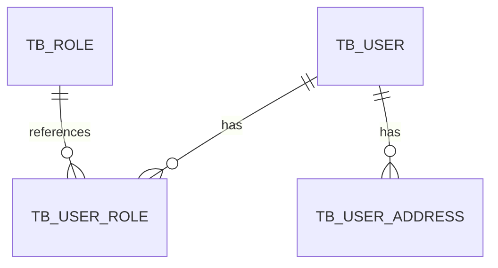

# 数据库表结构归档 Skill

将数据库表结构（DDL）进行结构化归档，生成可查询的表结构档案，支持旧项目改造时快速了解现有表设计，避免字段冲突和重复定义。

---

## 触发条件

- 旧项目改造需要了解现有表结构
- 新功能开发需要基于旧表扩展字段
- 数据库表结构变更后需要更新档案
- 用户明确指令："归档表结构" 或 "查询表信息"
- 代码生成时需要参考已有表的字段定义

---

## 输入

- 数据库连接信息（或 DDL SQL 文件）
- 表名（支持单表或多表批量归档）
- 所属服务/模块信息
- 归档上下文（Program ID、操作人等）

---

## 输出

- 表结构档案：`.qoder/repowiki/schemas/{table-name}.md`
- 表索引更新：`.qoder/repowiki/schemas/index.md`
- 服务表关系图：`.qoder/repowiki/schemas/{service}-tables.md`（可选）

---

## 归档流程

### Step 1: 提取表结构信息

从数据库或 DDL 文件提取表结构：

```yaml
schema_extraction:
  table_name: "tb_user"
  database: "mall_user"
  service: "mall-user"
  extraction_method: "DDL_FILE"  # 或 DATABASE_CONNECTION
  source: "repos/mall-user/src/main/resources/db/migration/V1__init.sql"
```

**提取内容**：
- 表基本信息（表名、注释、字符集、引擎）
- 字段清单（字段名、类型、长度、约束、默认值、注释）
- 索引信息（主键、唯一索引、普通索引、组合索引）
- 外键关系（关联表、关联字段、级联规则）
- 分区信息（如有）

### Step 2: 分析表关系

分析表与表之间的关系：

```yaml
relationship_analysis:
  upstream_tables:  # 上游依赖（被本表引用）
    - tb_department
  downstream_tables:  # 下游依赖（引用本表）
    - tb_user_role
    - tb_user_address
  related_features:  # 相关功能
    - F-001-user-management
    - F-002-user-auth
```

### Step 3: 生成表结构档案

读取模板：`.qoder/repowiki/schemas/_TEMPLATE/schema-template.md`

根据提取的信息填充模板，生成档案文件：

**档案路径**：`.qoder/repowiki/schemas/{service}/{table-name}.md`

### Step 4: 更新表索引

在 `.qoder/repowiki/schemas/index.md` 中添加条目：

```markdown
| 表名 | 所属服务 | 数据量 | 核心字段 | 归档日期 | 状态 |
|------|----------|--------|----------|----------|------|
| tb_user | mall-user | 100万+ | id, username, phone | 2026-02-27 | 活跃 |
```

### Step 5: 生成服务表关系图（可选）

为每个服务生成表关系概览：

```markdown
# mall-user 服务表结构

## 表清单

- [tb_user](./tb_user.md) - 用户主表
- [tb_user_role](./tb_user_role.md) - 用户角色关联表
- [tb_user_address](./tb_user_address.md) - 用户地址表

## ER 图


```

---

## 目录结构

```
.qoder/repowiki/schemas/
├── index.md                      # 表索引
├── _TEMPLATE/
│   └── schema-template.md        # 表结构模板
├── mall-user/                    # 按服务组织
│   ├── tb_user.md
│   ├── tb_user_role.md
│   └── _service-overview.md      # 服务表概览
├── mall-order/
│   ├── tb_order.md
│   ├── tb_order_item.md
│   └── _service-overview.md
└── ...
```

---

## 与代码生成的协作

### 旧表改造场景

```
用户: "需要在 tb_user 表上添加新字段"

Agent:
  → 调用 database-schema-archiving Skill 查询表结构
  → 读取 .qoder/repowiki/schemas/mall-user/tb_user.md
  → 获取现有字段列表，避免命名冲突
  → 了解索引情况，评估新字段对性能的影响
  → 调用 java-code-generation Skill 生成代码
```

### 新功能依赖旧表

```
用户: "新功能需要使用用户表"

Agent:
  → 查询 tb_user 表结构档案
  → 了解可用字段和字段含义
  → 确认关联关系（如 tb_user_role）
  → 基于现有表设计生成新代码
```

---

## 使用示例

### 示例 1: 归档单个表

```
用户: "归档 tb_user 表结构"

Agent:
  → 提取 tb_user 表 DDL
  → 分析字段、索引、外键
  → 生成档案: .qoder/repowiki/schemas/mall-user/tb_user.md
  → 更新索引: .qoder/repowiki/schemas/index.md
  → 返回: 已归档表结构，包含 15 个字段，3 个索引
```

### 示例 2: 批量归档服务所有表

```
用户: "归档 mall-order 服务的所有表"

Agent:
  → 扫描 mall-order 服务的所有表
  → 批量提取表结构
  → 生成档案: .qoder/repowiki/schemas/mall-order/*.md
  → 生成服务概览: .qoder/repowiki/schemas/mall-order/_service-overview.md
  → 更新索引
```

### 示例 3: 基于表档案生成代码

```
用户: "基于 tb_order 表生成 CRUD 代码"

Agent:
  → 读取 .qoder/repowiki/schemas/mall-order/tb_order.md
  → 提取字段信息用于生成 Entity
  → 了解索引用于生成查询优化建议
  → 生成 Controller/Service/Mapper 代码
```

---

## 返回格式

```
状态：已归档
表名：{table-name}
档案路径：.qoder/repowiki/schemas/{service}/{table-name}.md
索引更新：.qoder/repowiki/schemas/index.md

归档信息：
- 字段数量: {count}
- 索引数量: {count}
- 外键关系: {count}
- 关联表: {table1}, {table2}
- 后续代码生成可引用此档案
```

---

## 相关 Skill

- **知识库查询 Skill**: `.qoder/skills/knowledge-base-query.md`（用于检索表结构档案）
- **代码生成 Skill**: `.qoder/skills/java-code-generation.md`（基于表档案生成代码）
- **功能归档 Skill**: `.qoder/skills/feature-archiving.md`（关联功能与表）
- **API归档 Skill**: `.qoder/skills/api-archiving.md`
