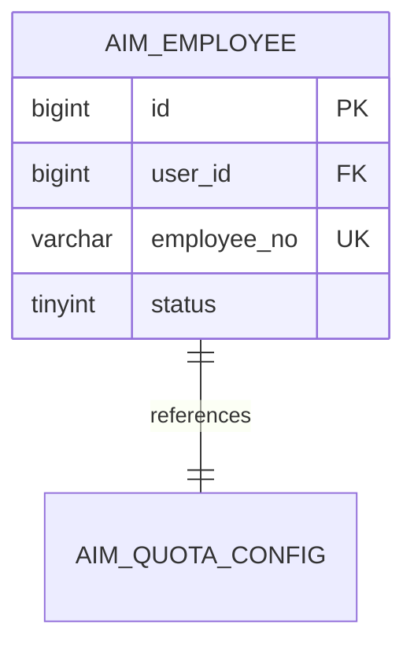
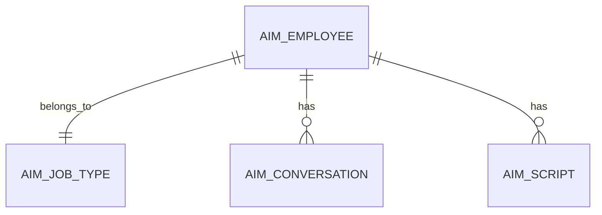

# Feature Archiving Skill

Archive completed features to `.qoder/repowiki/features/` for future development reference and reuse. This Skill also handles database table structure archiving to `.qoder/repowiki/schemas/`.

---

## Trigger Conditions

- Feature implementation completed
- User command: "archive feature" or "delegate: archive feature"
- Standard workflow final task in implementation Program
- Database table design completed and needs archiving

---

## Inputs

- Implementation Program workspace:
  - `tech-spec.md` — technical specification (contains data model design)
  - `answers.md` — requirement clarification results
  - `decisions.md` — technical decision records
  - Source code in `repos/` (Entity classes, DDL files)
- Current Program ID and REQ ID
- Database tables designed in this feature

---

## Outputs

### Feature Archive

- Feature archive → `.qoder/repowiki/features/F-{seq}-{name}/`
  - `archive.md` — feature description, interface list, core classes, design decisions, **database schema**
  - `reuse-guide.md` — how to reuse this feature
  - `snippets/` — reusable code snippets

### Database Schema Archive

- Schema archive → `.qoder/repowiki/schemas/{service}/{table-name}.md`
- Service overview → `.qoder/repowiki/schemas/{service}/_service-overview.md`
- Schema index → `.qoder/repowiki/schemas/index.md`

---

## Archive Structure

```
.qoder/repowiki/
├── features/                   # Feature archives
│   ├── index.md
│   ├── _TEMPLATE/
│   │   ├── feature-template.md   # Feature archive template
│   │   └── reuse-guide.md        # Reuse guide template
│   ├── F-001-create-agent/
│   │   ├── archive.md            # Feature archive (includes database schema section)
│   │   ├── reuse-guide.md
│   │   └── snippets/
│   └── F-002-job-type/
│       └── ...
│
└── schemas/                    # Database schema archives
    ├── index.md
    ├── _TEMPLATE/
    │   ├── schema-template.md    # Schema archive template
    │   └── _service-overview.md  # Service overview template
    ├── mall-agent/              # Service-level schema directory
    │   ├── _service-overview.md   # Service schema overview
    │   ├── aim_employee.md
    │   ├── aim_job_type.md
    │   └── ...
    ├── mall-user/
    │   ├── _service-overview.md
    │   └── aim_user.md
    └── ...
```

---

## Workflow

### Phase 1: Feature Archive

#### Step 1: Read Source Documents

1. Read tech-spec.md (extract data model section)
2. Read answers.md
3. Read decisions.md
4. Read key source files (Entity classes, Mapper files)
5. Check existing feature index

#### Step 2: Generate Archive ID

Generate next feature ID: `F-{sequence:000}-{feature-name}`

Example: `F-001-create-agent`

#### Step 3: Create Archive Directory

```bash
mkdir -p .qoder/repowiki/features/F-xxx-{name}/snippets
```

#### Step 4: Extract Database Schema Information

From tech-spec.md and source code, extract:
- Table names designed in this feature
- Entity class definitions (fields, types, constraints)
- Index definitions
- Table relationships
- DDL statements (if available)

#### Step 5: Generate archive.md

```markdown
---
feature_id: F-001
feature_name: Smart Employee Creation
program: P-2026-001-REQ-031
description: Create smart employee with validation and quota check
service: mall-agent
created_at: 2026-02-28
tags: [employee, creation, validation]
---

# F-001: Smart Employee Creation

## Overview

Brief description of the feature.

## Interfaces

| Interface | Path | Method | Description |
|-----------|------|--------|-------------|
| Create | /inner/api/v1/ai-employee/create | POST | Create smart employee |

## Core Classes

| Class | Type | Description |
|-------|------|-------------|
| AiEmployeeService | Service | Business logic |
| AimEmployeeDO | Entity | Database entity |

## Database Schema

### Tables Designed

| Table Name | Description | Design REQ | Archive Location |
|------------|-------------|------------|------------------|
| aim_employee | Smart employee main table | REQ-031 | schemas/mall-agent/aim_employee.md |
| aim_quota_config | Quota configuration table | REQ-032 | schemas/mall-agent/aim_quota_config.md |

### Table Relationships



### Key Design Decisions

- **Table naming**: Use `aim_` prefix for AI module tables
- **Primary key**: All tables use BIGINT AUTO_INCREMENT
- **Soft delete**: Use `is_deleted` field + unique index with deleted flag

## Design Decisions

### Decision 1: XXX
- **Context**: Why this decision
- **Decision**: What was decided
- **Rationale**: Why this approach

## Reuse Guide

See [reuse-guide.md](./reuse-guide.md)
```

#### Step 6: Generate reuse-guide.md

```markdown
# Reuse Guide: Smart Employee Creation

## When to Reuse

- Creating similar employee/agent entities
- Need validation + quota check pattern

## Key Components

1. **Validation Pattern**: See snippets/ValidationPattern.java
2. **Quota Check**: See snippets/QuotaCheck.java

## Database Schema Reuse

### Table Structure Reference

See [schemas/mall-agent/aim_employee.md](../schemas/mall-agent/aim_employee.md)

### Adaptation Points

| Original | Adapt To | Notes |
|----------|----------|-------|
| AiEmployee | XxxEntity | Change entity name |
| employeeQuota | xxxQuota | Change quota field |
| aim_employee | aim_xxx | Change table name |

## Code Snippets

See `snippets/` directory.
```

#### Step 7: Extract Code Snippets

Extract reusable code to `snippets/`:
- Controller pattern
- Service pattern
- Validation pattern
- Feign client pattern
- Entity/DO pattern
- Mapper XML pattern

#### Step 8: Update Feature Index

Update `.qoder/repowiki/features/index.md`:

```markdown
# Feature Index

| ID | Name | Service | Tags | Program | Tables |
|----|------|---------|------|---------|--------|
| F-001 | Smart Employee Creation | mall-agent | employee,creation | P-2026-001-REQ-031 | aim_employee |
```

---

### Phase 2: Database Schema Archive

#### Step 9: Create Service Schema Directory

```bash
mkdir -p .qoder/repowiki/schemas/{service}
```

Example: `mkdir -p .qoder/repowiki/schemas/mall-agent`

#### Step 10: Generate Table Schema Documents

For each table designed in this feature, generate:

**File**: `.qoder/repowiki/schemas/{service}/{table-name}.md`

```markdown
---
table_name: aim_employee
description: Smart employee main table, stores employee basic information and status
database: mall_agent
service: mall-agent
engine: InnoDB
charset: utf8mb4
designed_by: REQ-031
designed_at: 2026-02-28
feature_ref: F-001
version: v1.0
---

# aim_employee

## Basic Info

| Attribute | Value |
|-----------|-------|
| Table Name | aim_employee |
| Chinese Name | 智能员工表 |
| Service | mall-agent |
| Database | mall_agent |
| Designed By | REQ-031 |
| Feature Ref | F-001 |

## Field List

| Field Name | Data Type | Nullable | Default | Constraint | Comment |
|------------|-----------|----------|---------|------------|---------|
| id | BIGINT | NO | AUTO_INCREMENT | PK | Primary key ID |
| user_id | BIGINT | NO | - | FK | User ID, references aim_user.id |
| employee_no | VARCHAR(20) | NO | - | UK | Employee number, e.g., AIM001 |
| name | VARCHAR(50) | NO | - | - | Employee display name |
| job_type_id | BIGINT | NO | - | FK | Job type ID |
| spu_id | BIGINT | YES | NULL | FK | Associated SPU ID |
| style_code | VARCHAR(20) | NO | - | - | Personality style code |
| status | TINYINT | NO | 0 | - | Status: 0-pending_unlock, 1-pending_audit, 2-online, 3-paused, 4-banned |
| commission_rate | DECIMAL(5,4) | NO | 0.0100 | - | Commission rate, default 1% |
| unlock_count | INT | NO | 0 | - | Current unlock count |
| unlock_required | INT | NO | 3 | - | Required unlock count |
| total_revenue | DECIMAL(12,2) | NO | 0.00 | - | Total revenue |
| is_deleted | TINYINT | NO | 0 | - | Soft delete flag: 0-no, 1-yes |
| create_time | DATETIME | NO | CURRENT_TIMESTAMP | - | Create time |
| update_time | DATETIME | NO | CURRENT_TIMESTAMP | ON UPDATE | Update time |

## Index Info

| Index Name | Type | Fields | Comment |
|------------|------|--------|---------|
| PRIMARY | Primary | id | Primary key |
| uk_employee_no | Unique | employee_no | Employee number unique |
| uk_user_id_deleted | Unique | user_id, is_deleted | One active employee per user |
| idx_status | Normal | status | Status query |
| idx_job_type | Normal | job_type_id | Job type query |
| idx_spu | Normal | spu_id | SPU query |

## Foreign Keys

| Name | Field | Ref Table | Ref Field | On Delete |
|------|-------|-----------|-----------|-----------|
| fk_employee_user | user_id | aim_user | id | RESTRICT |
| fk_employee_job_type | job_type_id | aim_job_type | id | RESTRICT |

## DDL

```sql
CREATE TABLE `aim_employee` (
  `id` BIGINT NOT NULL AUTO_INCREMENT COMMENT 'Primary key ID',
  `user_id` BIGINT NOT NULL COMMENT 'User ID',
  `employee_no` VARCHAR(20) NOT NULL COMMENT 'Employee number',
  `name` VARCHAR(50) NOT NULL COMMENT 'Employee name',
  `job_type_id` BIGINT NOT NULL COMMENT 'Job type ID',
  `spu_id` BIGINT DEFAULT NULL COMMENT 'SPU ID',
  `style_code` VARCHAR(20) NOT NULL COMMENT 'Style code',
  `status` TINYINT NOT NULL DEFAULT 0 COMMENT 'Status',
  `commission_rate` DECIMAL(5,4) NOT NULL DEFAULT 0.0100 COMMENT 'Commission rate',
  `unlock_count` INT NOT NULL DEFAULT 0 COMMENT 'Unlock count',
  `unlock_required` INT NOT NULL DEFAULT 3 COMMENT 'Required unlock count',
  `total_revenue` DECIMAL(12,2) NOT NULL DEFAULT 0.00 COMMENT 'Total revenue',
  `is_deleted` TINYINT NOT NULL DEFAULT 0 COMMENT 'Soft delete flag',
  `create_time` DATETIME NOT NULL DEFAULT CURRENT_TIMESTAMP COMMENT 'Create time',
  `update_time` DATETIME NOT NULL DEFAULT CURRENT_TIMESTAMP ON UPDATE CURRENT_TIMESTAMP COMMENT 'Update time',
  PRIMARY KEY (`id`),
  UNIQUE KEY `uk_employee_no` (`employee_no`),
  UNIQUE KEY `uk_user_id_deleted` (`user_id`, `is_deleted`),
  KEY `idx_status` (`status`),
  KEY `idx_job_type` (`job_type_id`),
  KEY `idx_spu` (`spu_id`)
) ENGINE=InnoDB DEFAULT CHARSET=utf8mb4 COMMENT='Smart employee table';
```

## Business Rules

1. **Employee Number Generation**: Auto-generated with format AIM{sequence:000}
2. **Status Flow**: pending_unlock → pending_audit → online → (paused/banned)
3. **Soft Delete**: Use is_deleted field, physical delete not allowed
4. **Unique Constraint**: One active employee per user (user_id + is_deleted=0)

## Usage Scenarios

### Query by Employee Number
```sql
SELECT * FROM aim_employee 
WHERE employee_no = 'AIM001' AND is_deleted = 0;
```

### Query by User
```sql
SELECT * FROM aim_employee 
WHERE user_id = ? AND is_deleted = 0;
```

## Related Tables

| Table | Relationship | Description |
|-------|--------------|-------------|
| aim_user | N:1 | Employee belongs to user |
| aim_job_type | N:1 | Employee has job type |
| aim_conversation | 1:N | Employee has conversations |

## Change History

| Version | Date | Changes | REQ |
|---------|------|---------|-----|
| v1.0 | 2026-02-28 | Initial design | REQ-031 |
```

#### Step 11: Update Service Schema Overview

Generate/Update `.qoder/repowiki/schemas/{service}/_service-overview.md`:

```markdown
---
service: mall-agent
description: AI Agent Service Database Schema
tables_count: 14
created_at: 2026-02-28
---

# mall-agent Database Schema

## Overview

This service manages AI employee related data including employees, job types, conversations, scripts, knowledge base, etc.

## Table List

| Table Name | Chinese Name | Description | Designed By | Feature Ref |
|------------|--------------|-------------|-------------|-------------|
| aim_employee | 智能员工表 | Employee main table | REQ-031 | F-001 |
| aim_job_type | 岗位类型表 | Job type configuration | REQ-038 | F-00X |
| aim_quota_config | 名额配置表 | Quota configuration | REQ-032 | F-00X |
| ... | ... | ... | ... | ... |

## ER Diagram



## Naming Conventions

- Table prefix: `aim_` (AI Module)
- Primary key: `id` (BIGINT, AUTO_INCREMENT)
- Soft delete: `is_deleted` (TINYINT, 0/1)
- Time fields: `create_time`, `update_time` (DATETIME)
```

#### Step 12: Update Schema Index

Update `.qoder/repowiki/schemas/index.md`:

```markdown
---
title: Database Schema Index
services: 5
tables: 50+
---

# Database Schema Index

## Services

| Service | Tables | Description |
|---------|--------|-------------|
| [mall-agent](./mall-agent/_service-overview.md) | 14 | AI employee service |
| [mall-user](./mall-user/_service-overview.md) | 3 | User service |
| ... | ... | ... |

## Quick Reference

### By Table Name

| Table | Service | Description |
|-------|---------|-------------|
| aim_employee | mall-agent | Smart employee |
| aim_user | mall-user | User info |

### By Feature

| Feature | Tables |
|---------|--------|
| Employee Creation | aim_employee, aim_quota_config |
```

---

## Return Format

```
Status: Completed

Feature Archive: .qoder/repowiki/features/F-{id}-{name}/
Files:
  - archive.md
  - reuse-guide.md
  - snippets/

Schema Archives:
  - .qoder/repowiki/schemas/{service}/{table-1}.md
  - .qoder/repowiki/schemas/{service}/{table-2}.md
  - .qoder/repowiki/schemas/{service}/_service-overview.md

Index Updated:
  - .qoder/repowiki/features/index.md
  - .qoder/repowiki/schemas/index.md
  - .qoder/repowiki/schemas/{service}/_service-overview.md

Tables Archived: X
Features Archived: 1
```

---

## Integration with Development Workflow

### When to Archive

| Phase | Action | Output |
|-------|--------|--------|
| After REQ implementation | Archive feature | Feature archive + Schema archives |
| After table design | Archive schema only | Schema archives |
| After tech-spec confirmed | Pre-archive schema | Schema drafts (optional) |

### Cross-Reference

Feature archives and schema archives are cross-referenced:

1. **Feature → Schema**: Feature archive lists all tables designed
2. **Schema → Feature**: Schema document references which REQ/F designed it
3. **Bidirectional traceability**: Easy to find which feature created a table, or which tables a feature created

### Query Patterns

**Find tables by feature:**
```
Lookup: .qoder/repowiki/features/F-001/archive.md
Section: Database Schema → Tables Designed
```

**Find feature by table:**
```
Lookup: .qoder/repowiki/schemas/mall-agent/aim_employee.md
Frontmatter: designed_by, feature_ref
```

**Find all tables in a service:**
```
Lookup: .qoder/repowiki/schemas/{service}/_service-overview.md
Section: Table List
```
