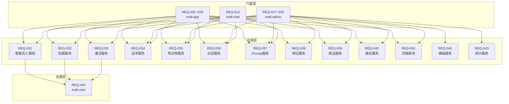

# 需求分解结果

## Program: P-2026-001-ai-agent-platform

### 需求概述

- **来源**: PRD 文档 ai-agent-platform-prd.md
- **功能模块**: AI智能体代理平台 - 用户申请成为智能员工，通过AI对话完成商品销售并获取佣金
- **涉及服务**: mall-admin, mall-app, mall-chat, mall-agent, mall-user

---

## 一、APP端 — 用户管理端

### REQ-001: [mall-app] 智能员工功能介绍页接口

- **来源**: PRD 第 3.1 节, 线框图 U-001
- **描述**: APP端获取智能员工功能介绍及用户当前名额信息
- **代码位置**: `repos/mall-app/src/main/java/com/aim/mall/app/controller/AiEmployeeAppController.java`
- **接口路径**: `GET /app/api/v1/ai-employee/intro`
- **依赖模块**:
  - 依赖服务: mall-agent
- **验收标准**:
  - [ ] 返回功能介绍文案
  - [ ] 返回用户当前可用名额
  - [ ] 返回已创建员工数量

### REQ-002: [mall-app] 创建智能员工申请接口

- **来源**: PRD 第 3.1.4 节, 线框图 U-002
- **描述**: 用户提交智能员工申请
- **代码位置**: `repos/mall-app/src/main/java/com/aim/mall/app/controller/AiEmployeeAppController.java`
- **接口路径**: `POST /app/api/v1/ai-employee/apply`
- **依赖模块**:
  - 依赖服务: mall-agent
- **请求参数**:
  - jobTypeId: 岗位类型ID
  - categoryId: 类目ID（商品销售岗位时必填）
  - spuId: 商品ID（商品销售岗位时必填）
  - styleCode: 人设风格编码
  - businessPlan: 商务合作信息
  - socialLinks: 社交平台链接
- **验收标准**:
  - [ ] 校验用户名额是否充足
  - [ ] 校验商品是否已被代理
  - [ ] 创建智能员工记录，状态为"待审核"
  - [ ] 返回员工编号（如AIM001）

### REQ-003: [mall-app] 获取智能员工申请状态接口

- **来源**: PRD 第 3.1.4 节, 线框图 U-002.5
- **描述**: 查询用户智能员工申请审核状态
- **代码位置**: `repos/mall-app/src/main/java/com/aim/mall/app/controller/AiEmployeeAppController.java`
- **接口路径**: `GET /app/api/v1/ai-employee/{employeeId}/status`
- **依赖模块**:
  - 依赖服务: mall-agent
- **验收标准**:
  - [ ] 返回员工基本信息
  - [ ] 返回审核状态（待审核/已通过/已驳回）
  - [ ] 驳回时返回驳回原因
  - [ ] 提供沙盒预览入口

### REQ-004: [mall-app] 智能员工解锁进度查询接口

- **来源**: PRD 第 3.1.4 节, 线框图 U-003
- **描述**: 查询智能员工解锁进度
- **代码位置**: `repos/mall-app/src/main/java/com/aim/mall/app/controller/AiEmployeeAppController.java`
- **接口路径**: `GET /app/api/v1/ai-employee/{employeeId}/unlock-progress`
- **依赖模块**:
  - 依赖服务: mall-agent
- **验收标准**:
  - [ ] 返回已邀请人数/需邀请人数
  - [ ] 返回员工基本信息
  - [ ] 返回关联商品信息

### REQ-005: [mall-app] 生成分享素材接口

- **来源**: PRD 第 3.1.4 节, 线框图 U-003
- **描述**: 生成智能员工分享海报/链接
- **代码位置**: `repos/mall-app/src/main/java/com/aim/mall/app/controller/AiEmployeeAppController.java`
- **接口路径**: `POST /app/api/v1/ai-employee/{employeeId}/share`
- **依赖模块**:
  - 依赖服务: mall-agent
- **验收标准**:
  - [ ] 生成分享链接
  - [ ] 生成分享海报（含二维码）
  - [ ] 返回小程序卡片配置

### REQ-006: [mall-app] 智能员工列表查询接口

- **来源**: PRD 第 3.2 节, 线框图 U-004
- **描述**: 查询用户已创建的智能员工列表
- **代码位置**: `repos/mall-app/src/main/java/com/aim/mall/app/controller/AiEmployeeAppController.java`
- **接口路径**: `GET /app/api/v1/ai-employee/list`
- **依赖模块**:
  - 依赖服务: mall-agent
- **验收标准**:
  - [ ] 支持按状态筛选
  - [ ] 返回员工总数、今日咨询、累计收益、本月收益统计
  - [ ] 返回员工列表（含状态、咨询量、转化率等）

### REQ-007: [mall-app] 智能员工操作接口组

- **来源**: PRD 第 3.2.4 节
- **描述**: 智能员工管理操作（下线、查看详情等）
- **代码位置**: `repos/mall-app/src/main/java/com/aim/mall/app/controller/AiEmployeeAppController.java`
- **接口路径**:
  - `POST /app/api/v1/ai-employee/{employeeId}/offline` - 下线员工
  - `GET /app/api/v1/ai-employee/{employeeId}/detail` - 查看详情
- **依赖模块**:
  - 依赖服务: mall-agent
- **验收标准**:
  - [ ] 下线操作校验用户权限
  - [ ] 下线后更新员工状态
  - [ ] 详情接口返回完整员工信息

### REQ-008: [mall-app] 话术管理接口组

- **来源**: PRD 第 3.2.4 节, 线框图 U-007/U-008
- **描述**: 用户管理智能员工话术
- **代码位置**: `repos/mall-app/src/main/java/com/aim/mall/app/controller/ScriptAppController.java`
- **接口路径**:
  - `GET /app/api/v1/ai-employee/{employeeId}/scripts` - 话术列表
  - `POST /app/api/v1/ai-employee/{employeeId}/scripts` - 新增话术
  - `PUT /app/api/v1/ai-employee/scripts/{scriptId}` - 编辑话术
  - `DELETE /app/api/v1/ai-employee/scripts/{scriptId}` - 删除话术
- **依赖模块**:
  - 依赖服务: mall-agent
- **验收标准**:
  - [ ] 支持话术CRUD操作
  - [ ] 提交后进入待审核状态
  - [ ] 返回话术审核状态

### REQ-009: [mall-app] 知识库管理接口组

- **来源**: PRD 第 3.2.4 节, 线框图 U-009/U-010
- **描述**: 用户管理智能员工知识库文件
- **代码位置**: `repos/mall-app/src/main/java/com/aim/mall/app/controller/KnowledgeAppController.java`
- **接口路径**:
  - `GET /app/api/v1/ai-employee/{employeeId}/knowledge` - 文件列表
  - `POST /app/api/v1/ai-employee/{employeeId}/knowledge/upload` - 上传文件
  - `DELETE /app/api/v1/ai-employee/knowledge/{fileId}` - 删除文件
- **依赖模块**:
  - 依赖服务: mall-agent
- **验收标准**:
  - [ ] 支持PDF/Word/TXT/Excel上传
  - [ ] 单文件大小限制10MB
  - [ ] 返回文件解析状态
  - [ ] 提交后进入待审核状态

### REQ-010: [mall-app] 对话记录查询接口

- **来源**: PRD 第 3.2.4 节, 线框图 U-005/U-006
- **描述**: 查询智能员工对话记录
- **代码位置**: `repos/mall-app/src/main/java/com/aim/mall/app/controller/ConversationAppController.java`
- **接口路径**: `GET /app/api/v1/ai-employee/{employeeId}/conversations`
- **依赖模块**:
  - 依赖服务: mall-agent
- **验收标准**:
  - [ ] 支持按时间范围筛选
  - [ ] 返回对话列表
  - [ ] 返回对话详情（消息内容）

---

## 二、APP端 — 用户使用端（消费者）

### REQ-011: [mall-app] 查询商品智能员工接口

- **来源**: PRD 第 4.1 节, 线框图 C-001
- **描述**: 查询商品详情页是否展示AI导购入口
- **代码位置**: `repos/mall-app/src/main/java/com/aim/mall/app/controller/AiEmployeeAppController.java`
- **接口路径**: `GET /app/api/v1/ai-employee/check-spu?spuId={spuId}`
- **依赖模块**:
  - 依赖服务: mall-agent
- **验收标准**:
  - [ ] 返回该SPU是否有在线智能员工
  - [ ] 返回智能员工基本信息（头像、名称）

### REQ-012: [mall-chat] AI对话接口

- **来源**: PRD 第 4.2 节, 线框图 C-002
- **描述**: 消费者与智能员工进行AI对话（SSE流式输出）
- **代码位置**: `repos/mall-chat/src/main/java/com/aim/mall/chat/controller/ChatController.java`
- **接口路径**: `POST /app/api/v1/chat/stream`
- **依赖模块**:
  - 依赖服务: mall-agent
  - 依赖外部: 通义千问API
- **请求参数**:
  - employeeId: 智能员工ID
  - message: 用户消息
  - conversationId: 对话会话ID（可选，首次为空）
- **验收标准**:
  - [ ] 支持SSE流式输出
  - [ ] 优先匹配话术库（相似度≥0.85）
  - [ ] 未命中话术时检索知识库Top3
  - [ ] 构建Prompt调用千问API
  - [ ] 记录对话日志
  - [ ] 首字响应≤2s

### REQ-013: [mall-app] 对话评分接口

- **来源**: PRD 第 4.3 节, 线框图 C-004
- **描述**: 用户对对话进行评分
- **代码位置**: `repos/mall-app/src/main/java/com/aim/mall/app/controller/ConversationAppController.java`
- **接口路径**: `POST /app/api/v1/conversations/{conversationId}/rating`
- **依赖模块**:
  - 依赖服务: mall-agent
- **请求参数**:
  - rating: 1-5星评分
  - tags: 评价标签数组
  - feedback: 文字反馈
- **验收标准**:
  - [ ] 记录评分信息
  - [ ] 支持快捷标签选择

### REQ-014: [mall-app] 对话举报接口

- **来源**: PRD 第 4.3 节, 线框图 C-005
- **描述**: 用户举报对话内容
- **代码位置**: `repos/mall-app/src/main/java/com/aim/mall/app/controller/ConversationAppController.java`
- **接口路径**: `POST /app/api/v1/conversations/{conversationId}/report`
- **依赖模块**:
  - 依赖服务: mall-agent
- **请求参数**:
  - reportType: 举报类型
  - description: 举报说明
  - screenshots: 截图URL数组
- **验收标准**:
  - [ ] 记录举报信息
  - [ ] 支持多图上传

### REQ-015: [mall-app] 解锁详情页接口

- **来源**: PRD 第 4.4 节, 线框图 C-006
- **描述**: 好友点击分享链接后查看解锁详情
- **代码位置**: `repos/mall-app/src/main/java/com/aim/mall/app/controller/AiEmployeeAppController.java`
- **接口路径**: `GET /app/api/v1/ai-employee/unlock-detail`
- **依赖模块**:
  - 依赖服务: mall-agent
- **请求参数**:
  - inviteCode: 邀请码
- **验收标准**:
  - [ ] 返回邀请人信息
  - [ ] 返回智能员工信息（编号、名称、风格、岗位）
  - [ ] 返回关联商品信息
  - [ ] 返回解锁进度

### REQ-016: [mall-app] 帮TA解锁接口

- **来源**: PRD 第 4.4 节, 线框图 C-006
- **描述**: 好友完成注册后助力解锁
- **代码位置**: `repos/mall-app/src/main/java/com/aim/mall/app/controller/AiEmployeeAppController.java`
- **接口路径**: `POST /app/api/v1/ai-employee/help-unlock`
- **依赖模块**:
  - 依赖服务: mall-agent, mall-user
- **请求参数**:
  - inviteCode: 邀请码
  - userId: 当前用户ID
- **验收标准**:
  - [ ] 校验用户是否已注册
  - [ ] 记录激活记录
  - [ ] 更新解锁进度
  - [ ] 达到解锁人数时更新员工状态为"待审核"或"已上线"

---

## 三、智能体代理平台 — 管理后台

### REQ-017: [mall-admin] 首页仪表盘接口

- **来源**: PRD 第 5.1 节, 线框图 A-001
- **描述**: 管理后台首页核心指标统计
- **代码位置**: `repos/mall-admin/src/main/java/com/aim/mall/admin/controller/AiEmployeeAdminController.java`
- **接口路径**: `GET /admin/api/v1/dashboard`
- **依赖模块**:
  - 依赖服务: mall-agent
- **验收标准**:
  - [ ] 返回智能员工总数
  - [ ] 返回已上线员工数
  - [ ] 返回今日咨询量
  - [ ] 返回今日成交额
  - [ ] 返回待审核数量（员工+话术+知识库）
  - [ ] 返回趋势数据（近7/30天）

### REQ-018: [mall-admin] 岗位管理接口组

- **来源**: PRD 第 5.2 节, 线框图 A-002/A-003
- **描述**: 管理智能员工岗位类型
- **代码位置**: `repos/mall-admin/src/main/java/com/aim/mall/admin/controller/JobTypeAdminController.java`
- **接口路径**:
  - `GET /admin/api/v1/job-types` - 岗位列表
  - `POST /admin/api/v1/job-types` - 新增岗位
  - `PUT /admin/api/v1/job-types/{jobTypeId}` - 编辑岗位
  - `PUT /admin/api/v1/job-types/{jobTypeId}/status` - 启用/禁用
- **依赖模块**:
  - 依赖服务: mall-agent
- **验收标准**:
  - [ ] 支持岗位CRUD
  - [ ] 返回关联员工数
  - [ ] 支持启用/禁用

### REQ-019: [mall-admin] 名额配置接口组

- **来源**: PRD 第 5.3 节, 线框图 A-004
- **描述**: 配置用户等级初始名额及解锁规则
- **代码位置**: `repos/mall-admin/src/main/java/com/aim/mall/admin/controller/QuotaConfigAdminController.java`
- **接口路径**:
  - `GET /admin/api/v1/quota-config` - 获取配置
  - `PUT /admin/api/v1/quota-config` - 保存配置
- **依赖模块**:
  - 依赖服务: mall-agent
- **验收标准**:
  - [ ] 配置A/B/C/D/E等级初始名额
  - [ ] 配置销售额解锁规则（多级阈值）
  - [ ] 配置解锁上限
  - [ ] 配置默认解锁人数

### REQ-020: [mall-admin] 代理商品配置接口组

- **来源**: PRD 第 5.4 节, 线框图 A-005
- **描述**: 管理可代理的商品池
- **代码位置**: `repos/mall-admin/src/main/java/com/aim/mall/admin/controller/AgentProductAdminController.java`
- **接口路径**:
  - `GET /admin/api/v1/agent-products` - 商品列表
  - `POST /admin/api/v1/agent-products/import` - 批量导入
  - `DELETE /admin/api/v1/agent-products/{spuId}` - 移除商品
- **依赖模块**:
  - 依赖服务: mall-agent
- **验收标准**:
  - [ ] 支持Excel批量导入
  - [ ] 支持按代理状态、类目筛选
  - [ ] 返回代理员工信息
  - [ ] 已代理商品不可移除

### REQ-021: [mall-admin] 类目配置接口组

- **来源**: PRD 第 5.4.6 节, 线框图 A-005-1/A-005-2
- **描述**: 配置前端类目与后端类目的映射关系
- **代码位置**: `repos/mall-admin/src/main/java/com/aim/mall/admin/controller/CategoryMappingAdminController.java`
- **接口路径**:
  - `GET /admin/api/v1/category-mappings` - 类目映射列表
  - `POST /admin/api/v1/category-mappings` - 新增映射
  - `PUT /admin/api/v1/category-mappings/{mappingId}` - 编辑映射
  - `DELETE /admin/api/v1/category-mappings/{mappingId}` - 删除映射
- **依赖模块**:
  - 依赖服务: mall-agent
- **验收标准**:
  - [ ] 配置前端类目编码（关联商品服务热门类目）
  - [ ] 配置前端类目名称
  - [ ] 配置后端类目映射（多选）
  - [ ] 支持启用/禁用

### REQ-022: [mall-admin] 激活记录管理接口组

- **来源**: PRD 第 5.5 节, 线框图 A-017/A-017-1
- **描述**: 管理用户激活智能员工的记录
- **代码位置**: `repos/mall-admin/src/main/java/com/aim/mall/admin/controller/ActivationRecordAdminController.java`
- **接口路径**:
  - `GET /admin/api/v1/activation-records` - 激活记录列表
  - `POST /admin/api/v1/activation-records` - 手动新增激活
- **依赖模块**:
  - 依赖服务: mall-agent
- **验收标准**:
  - [ ] 支持多维度搜索（邀请人、被邀请人、智能员工）
  - [ ] 支持按激活类型、时间范围筛选
  - [ ] 手动激活时校验重复激活
  - [ ] 手动激活时邀请者固定为"系统"

### REQ-023: [mall-admin] 智能员工审核接口组

- **来源**: PRD 第 5.6 节, 线框图 A-006/A-007
- **描述**: 审核用户提交的智能员工申请
- **代码位置**: `repos/mall-admin/src/main/java/com/aim/mall/admin/controller/EmployeeAuditAdminController.java`
- **接口路径**:
  - `GET /admin/api/v1/employee-audits` - 审核列表
  - `GET /admin/api/v1/employee-audits/{employeeId}/detail` - 审核详情
  - `POST /admin/api/v1/employee-audits/{employeeId}/approve` - 通过
  - `POST /admin/api/v1/employee-audits/{employeeId}/reject` - 驳回
- **依赖模块**:
  - 依赖服务: mall-agent
- **验收标准**:
  - [ ] 支持按状态、岗位筛选
  - [ ] 展示Prompt预览
  - [ ] 通过时更新状态为"待解锁"或"已上线"
  - [ ] 驳回时必填驳回原因
  - [ ] 驳回原因同步到用户端

### REQ-024: [mall-admin] 智能员工管理接口组

- **来源**: PRD 第 5.7 节, 线框图 A-008/A-009
- **描述**: 管理所有智能员工
- **代码位置**: `repos/mall-admin/src/main/java/com/aim/mall/admin/controller/EmployeeManageAdminController.java`
- **接口路径**:
  - `GET /admin/api/v1/employees` - 员工列表
  - `GET /admin/api/v1/employees/{employeeId}/detail` - 员工详情
  - `POST /admin/api/v1/employees/{employeeId}/pause` - 暂停
  - `POST /admin/api/v1/employees/{employeeId}/resume` - 恢复
  - `POST /admin/api/v1/employees/{employeeId}/warn` - 警告
  - `POST /admin/api/v1/employees/{employeeId}/ban` - 封禁
  - `PUT /admin/api/v1/employees/{employeeId}/commission` - 修改佣金比例
- **依赖模块**:
  - 依赖服务: mall-agent
- **验收标准**:
  - [ ] 支持多维度筛选
  - [ ] 返回业务数据（咨询量、转化率、收益）
  - [ ] 支持状态变更操作
  - [ ] 封禁时释放SPU绑定和名额占用

### REQ-025: [mall-admin] Prompt管理接口组

- **来源**: PRD 第 5.7.4 节, 线框图 A-010
- **描述**: 管理智能员工Prompt
- **代码位置**: `repos/mall-admin/src/main/java/com/aim/mall/admin/controller/PromptAdminController.java`
- **接口路径**:
  - `GET /admin/api/v1/employees/{employeeId}/prompt` - 查看Prompt
  - `PUT /admin/api/v1/employees/{employeeId}/prompt` - 编辑Prompt
- **依赖模块**:
  - 依赖服务: mall-agent
- **验收标准**:
  - [ ] 展示当前生效Prompt
  - [ ] 支持直接编辑
  - [ ] 支持变量说明展示

### REQ-026: [mall-admin] 人设风格管理接口组

- **来源**: PRD 第 5.7.5 节, 线框图 A-016
- **描述**: 管理智能员工人设风格
- **代码位置**: `repos/mall-admin/src/main/java/com/aim/mall/admin/controller/StyleConfigAdminController.java`
- **接口路径**:
  - `GET /admin/api/v1/style-configs` - 风格列表
  - `POST /admin/api/v1/style-configs` - 新增风格
  - `PUT /admin/api/v1/style-configs/{styleId}` - 编辑风格
  - `DELETE /admin/api/v1/style-configs/{styleId}` - 删除风格
- **依赖模块**:
  - 依赖服务: mall-agent
- **验收标准**:
  - [ ] 支持风格CRUD
  - [ ] 包含图标、名称、描述、Prompt预览
  - [ ] 支持排序
  - [ ] 支持启用/禁用

### REQ-027: [mall-admin] 对话记录审核接口组

- **来源**: PRD 第 5.8.1 节, 线框图 A-011/A-012
- **描述**: 审核智能员工对话记录
- **代码位置**: `repos/mall-admin/src/main/java/com/aim/mall/admin/controller/ConversationAuditAdminController.java`
- **接口路径**:
  - `GET /admin/api/v1/conversation-audits` - 对话列表
  - `GET /admin/api/v1/conversation-audits/{conversationId}/detail` - 对话详情
  - `POST /admin/api/v1/conversation-audits/{conversationId}/mark` - 标记违规
- **依赖模块**:
  - 依赖服务: mall-agent
- **验收标准**:
  - [ ] 支持按员工、类型、时间筛选
  - [ ] 支持仅看举报
  - [ ] 展示对话完整内容
  - [ ] 支持标记违规类型

### REQ-028: [mall-admin] 话术审核接口组

- **来源**: PRD 第 5.8.2 节, 线框图 A-013
- **描述**: 审核用户提交的话术
- **代码位置**: `repos/mall-admin/src/main/java/com/aim/mall/admin/controller/ScriptAuditAdminController.java`
- **接口路径**:
  - `GET /admin/api/v1/script-audits` - 话术列表
  - `POST /admin/api/v1/script-audits/{scriptId}/approve` - 通过
  - `POST /admin/api/v1/script-audits/{scriptId}/reject` - 驳回
  - `POST /admin/api/v1/script-audits/batch-approve` - 批量通过
- **依赖模块**:
  - 依赖服务: mall-agent
- **验收标准**:
  - [ ] 展示话术相似度
  - [ ] 支持批量通过
  - [ ] 相似度>60%高亮警告

### REQ-029: [mall-admin] 话术模板管理接口组

- **来源**: PRD 第 5.8.2 节, 线框图 A-015
- **描述**: 管理话术模板
- **代码位置**: `repos/mall-admin/src/main/java/com/aim/mall/admin/controller/ScriptTemplateAdminController.java`
- **接口路径**:
  - `GET /admin/api/v1/script-templates` - 模板列表
  - `POST /admin/api/v1/script-templates` - 新增模板
  - `PUT /admin/api/v1/script-templates/{templateId}` - 编辑模板
  - `DELETE /admin/api/v1/script-templates/{templateId}` - 删除模板
- **依赖模块**:
  - 依赖服务: mall-agent
- **验收标准**:
  - [ ] 支持模板CRUD
  - [ ] 包含触发条件、话术内容、适用岗位
  - [ ] 支持启用/禁用
  - [ ] 支持Excel批量导入

### REQ-030: [mall-admin] 知识库审核接口组

- **来源**: PRD 第 5.8.3 节, 线框图 A-014
- **描述**: 审核用户上传的知识库文件
- **代码位置**: `repos/mall-admin/src/main/java/com/aim/mall/admin/controller/KnowledgeAuditAdminController.java`
- **接口路径**:
  - `GET /admin/api/v1/knowledge-audits` - 文件列表
  - `GET /admin/api/v1/knowledge-audits/{fileId}/preview` - 预览文件
  - `POST /admin/api/v1/knowledge-audits/{fileId}/approve` - 通过
  - `POST /admin/api/v1/knowledge-audits/{fileId}/reject` - 驳回
- **依赖模块**:
  - 依赖服务: mall-agent
- **验收标准**:
  - [ ] 展示解析状态
  - [ ] 支持文件预览
  - [ ] 驳回需填原因

---

## 四、mall-agent 核心业务服务

### REQ-031: [mall-agent] 智能员工应用服务

- **来源**: PRD 第 3/4/5 章
- **描述**: 智能员工核心业务逻辑实现
- **代码位置**: `repos/mall-agent/src/main/java/com/aim/mall/agent/service/AiEmployeeService.java`
- **Inner 接口路径**:
  - `POST /inner/api/v1/ai-employee/create` - 创建员工
  - `GET /inner/api/v1/ai-employee/detail` - 查询详情
  - `GET /inner/api/v1/ai-employee/list` - 查询列表
  - `POST /inner/api/v1/ai-employee/{employeeId}/status` - 更新状态
- **依赖模块**:
  - 依赖服务: mall-user
  - 依赖数据库表: aim_agent_employee（本需求同步设计）, aim_job_type（查询归档）, aim_agent_product（查询归档）
- **被依赖**: REQ-001, REQ-002, REQ-003, REQ-006, REQ-011, REQ-017, REQ-023, REQ-024
- **验收标准**:
  - [ ] 设计 aim_agent_employee 表结构
  - [ ] 实现员工创建逻辑（含编号生成AIMxxx）
  - [ ] 实现状态流转（待审核→待解锁→已上线→已暂停/已封禁）
  - [ ] 校验用户名额
  - [ ] 校验商品代理冲突
  - [ ] 调用mall-user查询用户信息
- **归档内容**: 完成后归档表结构到 `feature-archive.md#aim_agent_employee`
- **前置查询**: 实现前查询 `feature-archive.md#aim_job_type` 和 `feature-archive.md#aim_agent_product`

### REQ-032: [mall-agent] 名额管理服务

- **来源**: PRD 第 5.3 节
- **描述**: 用户名额计算与解锁逻辑
- **代码位置**: `repos/mall-agent/src/main/java/com/aim/mall/agent/service/QuotaService.java`
- **Inner 接口路径**:
  - `GET /inner/api/v1/quota/user-quota` - 查询用户名额
  - `POST /inner/api/v1/quota/check` - 校验名额
  - `POST /inner/api/v1/quota/unlock` - 销售额解锁名额
- **依赖模块**:
  - 依赖服务: mall-user
  - 依赖数据库表: aim_quota_config（本需求同步设计）, aim_agent_employee（依赖REQ-031归档）
- **被依赖**: REQ-001, REQ-002, REQ-019, REQ-031
- **验收标准**:
  - [ ] 设计 aim_quota_config 表结构
  - [ ] 根据用户等级计算初始名额
  - [ ] 校验创建时名额充足
  - [ ] 销售额达标自动解锁名额
  - [ ] 封禁时释放名额
- **归档内容**: 完成后归档表结构到 `feature-archive.md#aim_quota_config`
- **前置查询**: 实现前查询 `feature-archive.md#aim_agent_employee` 获取员工表结构

### REQ-033: [mall-agent] 解锁与激活服务

- **来源**: PRD 第 3.1.5 节
- **描述**: 智能员工解锁流程管理
- **代码位置**: `repos/mall-agent/src/main/java/com/aim/mall/agent/service/ActivationService.java`
- **Inner 接口路径**:
  - `GET /inner/api/v1/activation/progress` - 查询进度
  - `POST /inner/api/v1/activation/help` - 助力解锁
  - `POST /inner/api/v1/activation/manual` - 手动激活
- **依赖模块**:
  - 依赖服务: mall-user
  - 依赖数据库表: aim_activation_record（本需求同步设计）, aim_agent_employee（查询归档）
- **被依赖**: REQ-004, REQ-015, REQ-016, REQ-022
- **验收标准**:
  - [ ] 设计 aim_activation_record 表结构
  - [ ] 记录每次激活记录
  - [ ] 校验用户是否已注册
  - [ ] 达到解锁人数自动更新状态
  - [ ] 防止重复激活
- **归档内容**: 完成后归档表结构到 `feature-archive.md#aim_activation_record`
- **前置查询**: 实现前查询 `feature-archive.md#aim_agent_employee` 获取员工表结构

### REQ-034: [mall-agent] 话术管理服务

- **来源**: PRD 第 3.2.4/5.8.2 节
- **描述**: 话术CRUD及审核流程
- **代码位置**: `repos/mall-agent/src/main/java/com/aim/mall/agent/service/ScriptService.java`
- **Inner 接口路径**:
  - `GET /inner/api/v1/scripts/list` - 话术列表
  - `POST /inner/api/v1/scripts/create` - 创建话术
  - `PUT /inner/api/v1/scripts/update` - 更新话术
  - `DELETE /inner/api/v1/scripts/delete` - 删除话术
  - `POST /inner/api/v1/scripts/audit` - 审核话术
  - `POST /inner/api/v1/scripts/match` - 话术匹配
- **依赖模块**:
  - 依赖数据库表: aim_agent_employee_script（本需求同步设计）
- **被依赖**: REQ-008, REQ-012, REQ-028, REQ-029
- **验收标准**:
  - [ ] 设计 aim_agent_employee_script 表结构
  - [ ] 支持话术CRUD
  - [ ] 提交后状态为"待审核"
  - [ ] 审核通过后才生效
  - [ ] 话术匹配（相似度≥0.85）
- **归档内容**: 完成后归档表结构到 `feature-archive.md#aim_agent_employee_script`

### REQ-035: [mall-agent] 知识库管理服务

- **来源**: PRD 第 3.2.4/5.8.3 节
- **描述**: 知识库文件管理及向量检索
- **代码位置**: `repos/mall-agent/src/main/java/com/aim/mall/agent/service/KnowledgeService.java`
- **Inner 接口路径**:
  - `GET /inner/api/v1/knowledge/list` - 文件列表
  - `POST /inner/api/v1/knowledge/upload` - 上传文件
  - `DELETE /inner/api/v1/knowledge/delete` - 删除文件
  - `POST /inner/api/v1/knowledge/audit` - 审核文件
  - `POST /inner/api/v1/knowledge/retrieve` - 向量检索
- **依赖模块**:
  - 依赖外部: 向量数据库(Milvus), Embedding服务
  - 依赖数据库表: aim_knowledge_file（本需求同步设计）
- **被依赖**: REQ-009, REQ-012, REQ-030
- **验收标准**:
  - [ ] 设计 aim_knowledge_file 表结构
  - [ ] 文件上传与解析
  - [ ] 解析状态跟踪
  - [ ] 向量存储与检索（Top3）
  - [ ] 审核流程
- **归档内容**: 完成后归档表结构到 `feature-archive.md#aim_knowledge_file`

### REQ-036: [mall-agent] 对话记录服务

- **来源**: PRD 第 3.2.4/4.2/5.8.1 节
- **描述**: 对话记录存储与查询
- **代码位置**: `repos/mall-agent/src/main/java/com/aim/mall/agent/service/ConversationService.java`
- **Inner 接口路径**:
  - `GET /inner/api/v1/conversations/list` - 对话列表
  - `GET /inner/api/v1/conversations/detail` - 对话详情
  - `POST /inner/api/v1/conversations/save` - 保存对话
  - `POST /inner/api/v1/conversations/rating` - 评分
  - `POST /inner/api/v1/conversations/report` - 举报
- **依赖模块**:
  - 依赖数据库表: aim_conversation, aim_conversation_message, aim_conversation_report（本需求同步设计）
- **被依赖**: REQ-010, REQ-012, REQ-013, REQ-014, REQ-027
- **验收标准**:
  - [ ] 设计 aim_conversation 表结构
  - [ ] 设计 aim_conversation_message 表结构
  - [ ] 设计 aim_conversation_report 表结构
  - [ ] 记录完整对话内容
  - [ ] 支持评分与举报
  - [ ] 支持运营审核标记
- **归档内容**: 完成后归档表结构到 `feature-archive.md#aim_conversation` 等

### REQ-037: [mall-agent] Prompt生成服务

- **来源**: PRD 第 6.2 节
- **描述**: 根据配置动态生成Prompt
- **代码位置**: `repos/mall-agent/src/main/java/com/aim/mall/agent/service/PromptService.java`
- **Inner 接口路径**:
  - `GET /inner/api/v1/prompt/generate` - 生成Prompt
  - `GET /inner/api/v1/prompt/preview` - 预览Prompt
- **依赖模块**:
  - 依赖数据库表: aim_agent_employee, aim_style_config, aim_job_type（均查询归档）
- **被依赖**: REQ-012, REQ-023, REQ-025
- **验收标准**:
  - [ ] 根据员工配置选择模板
  - [ ] 变量替换（商品信息、人设风格等）
  - [ ] 返回完整Prompt内容
- **前置查询**: 实现前查询 feature-archive.md 获取相关表结构

### REQ-038: [mall-agent] 岗位类型管理服务

- **来源**: PRD 第 5.2 节
- **描述**: 岗位类型CRUD
- **代码位置**: `repos/mall-agent/src/main/java/com/aim/mall/agent/service/JobTypeService.java`
- **Inner 接口路径**:
  - `GET /inner/api/v1/job-types/list` - 列表
  - `POST /inner/api/v1/job-types/create` - 创建
  - `PUT /inner/api/v1/job-types/update` - 更新
  - `PUT /inner/api/v1/job-types/status` - 状态变更
- **依赖模块**:
  - 依赖数据库表: aim_job_type（本需求同步设计）
- **被依赖**: REQ-018, REQ-031
- **验收标准**:
  - [ ] 设计 aim_job_type 表结构
  - [ ] 支持岗位CRUD
  - [ ] 返回关联员工数
- **归档内容**: 完成后归档表结构到 `feature-archive.md#aim_job_type`

### REQ-039: [mall-agent] 代理商品服务

- **来源**: PRD 第 5.4 节
- **描述**: 代理商品池管理
- **代码位置**: `repos/mall-agent/src/main/java/com/aim/mall/agent/service/AgentProductService.java`
- **Inner 接口路径**:
  - `GET /inner/api/v1/agent-products/list` - 列表
  - `POST /inner/api/v1/agent-products/import` - 导入
  - `DELETE /inner/api/v1/agent-products/remove` - 移除
- **依赖模块**:
  - 依赖数据库表: aim_agent_product（本需求同步设计）
- **被依赖**: REQ-002, REQ-020
- **验收标准**:
  - [ ] 设计 aim_agent_product 表结构
  - [ ] 支持Excel导入
  - [ ] 校验商品是否存在
  - [ ] 已代理商品不可移除
- **归档内容**: 完成后归档表结构到 `feature-archive.md#aim_agent_product`

### REQ-040: [mall-agent] 类目映射服务

- **来源**: PRD 第 5.4.6 节
- **描述**: 前端类目与后端类目映射管理
- **代码位置**: `repos/mall-agent/src/main/java/com/aim/mall/agent/service/CategoryMappingService.java`
- **Inner 接口路径**:
  - `GET /inner/api/v1/category-mappings/list` - 列表
  - `POST /inner/api/v1/category-mappings/create` - 创建
  - `PUT /inner/api/v1/category-mappings/update` - 更新
  - `DELETE /inner/api/v1/category-mappings/delete` - 删除
- **依赖模块**:
  - 依赖数据库表: aim_category_mapping（本需求同步设计）
- **被依赖**: REQ-002, REQ-021
- **验收标准**:
  - [ ] 设计 aim_category_mapping 表结构
  - [ ] 支持映射CRUD
  - [ ] 一个前端类目映射多个后端类目
- **归档内容**: 完成后归档表结构到 `feature-archive.md#aim_category_mapping`

### REQ-041: [mall-agent] 人设风格服务

- **来源**: PRD 第 5.7.5 节
- **描述**: 人设风格配置管理
- **代码位置**: `repos/mall-agent/src/main/java/com/aim/mall/agent/service/StyleConfigService.java`
- **Inner 接口路径**:
  - `GET /inner/api/v1/style-configs/list` - 列表
  - `POST /inner/api/v1/style-configs/create` - 创建
  - `PUT /inner/api/v1/style-configs/update` - 更新
  - `DELETE /inner/api/v1/style-configs/delete` - 删除
- **依赖模块**:
  - 依赖数据库表: aim_style_config（本需求同步设计）
- **被依赖**: REQ-026, REQ-037
- **验收标准**:
  - [ ] 设计 aim_style_config 表结构
  - [ ] 支持风格CRUD
  - [ ] 包含Prompt模板
  - [ ] 支持排序
- **归档内容**: 完成后归档表结构到 `feature-archive.md#aim_style_config`

### REQ-042: [mall-agent] 话术模板服务

- **来源**: PRD 第 5.8.2 节
- **描述**: 话术模板管理
- **代码位置**: `repos/mall-agent/src/main/java/com/aim/mall/agent/service/ScriptTemplateService.java`
- **Inner 接口路径**:
  - `GET /inner/api/v1/script-templates/list` - 列表
  - `POST /inner/api/v1/script-templates/create` - 创建
  - `PUT /inner/api/v1/script-templates/update` - 更新
  - `DELETE /inner/api/v1/script-templates/delete` - 删除
- **依赖模块**:
  - 依赖数据库表: aim_script_template（本需求同步设计）
- **被依赖**: REQ-029
- **验收标准**:
  - [ ] 设计 aim_script_template 表结构
  - [ ] 支持模板CRUD
  - [ ] 支持Excel导入
- **归档内容**: 完成后归档表结构到 `feature-archive.md#aim_script_template`

### REQ-043: [mall-agent] 首页统计服务

- **来源**: PRD 第 5.1 节
- **描述**: 仪表盘数据统计
- **代码位置**: `repos/mall-agent/src/main/java/com/aim/mall/agent/service/DashboardService.java`
- **Inner 接口路径**: `GET /inner/api/v1/dashboard/statistics`
- **依赖模块**:
  - 依赖数据库表: aim_agent_employee, aim_conversation, aim_agent_employee_script, aim_knowledge_file（均查询归档）
- **被依赖**: REQ-017
- **验收标准**:
  - [ ] 统计员工总数、上线数
  - [ ] 统计今日咨询量
  - [ ] 统计待审核数量
  - [ ] 返回趋势数据
- **前置查询**: 实现前查询 feature-archive.md 获取相关表结构

---

## 五、mall-user 支撑服务

### REQ-044: [mall-user] 用户信息查询服务

- **来源**: PRD 第 2 章
- **描述**: 提供用户信息查询接口供mall-agent调用
- **代码位置**: `repos/mall-user/src/main/java/com/aim/mall/user/feign/UserFeignService.java`
- **Inner 接口路径**:
  - `GET /inner/api/v1/user/detail?userId={userId}` - 用户详情
  - `GET /inner/api/v1/user/level?userId={userId}` - 用户等级
  - `GET /inner/api/v1/user/search?keyword={keyword}` - 用户搜索
- **依赖模块**:
  - 依赖数据库表: aim_user（本需求同步设计）
- **被依赖**: REQ-031, REQ-032, REQ-033
- **验收标准**:
  - [ ] 设计 aim_user 表结构
  - [ ] 定义Feign接口（Query参数）
  - [ ] 返回用户基本信息
  - [ ] 返回用户等级
  - [ ] 支持用户搜索

---

## 六、跨服务共享定义

### REQ-045: [SHARED] Feign接口定义

- **描述**: 定义跨服务调用的Feign接口
- **代码位置**:
  - `repos/mall-agent/src/main/java/com/aim/mall/agent/dto/inner/` - mall-agent对外提供的DTO
  - `repos/mall-user/src/main/java/com/aim/mall/user/feign/` - mall-user Feign接口
  - `repos/mall-admin/src/main/java/com/aim/mall/admin/feign/` - mall-admin Feign客户端
  - `repos/mall-app/src/main/java/com/aim/mall/app/feign/` - mall-app Feign客户端
  - `repos/mall-chat/src/main/java/com/aim/mall/chat/feign/` - mall-chat Feign客户端
- **涉及接口**:
  - UserFeignClient - 用户服务调用
  - AiEmployeeFeignClient - 智能员工服务调用
- **被依赖**: REQ-001~REQ-044
- **验收标准**:
  - [ ] 定义Request/Response DTO
  - [ ] 定义Feign接口
  - [ ] 统一返回格式

---

## 数据库设计汇总

> **说明**：本项目的表设计采用"按需建表 + 即时归档"策略。每个需求负责设计自己需要的表，完成后归档到 `feature-archive.md`。以下清单汇总所有表及其归档位置。

### 表清单

| 序号 | 表名 | 所属服务 | 用途 | 设计需求 | 归档位置 |
|------|------|----------|------|----------|----------|
| 1 | aim_user | mall-user | 用户表 | REQ-044 | feature-archive.md#aim_user |
| 2 | aim_job_type | mall-agent | 岗位类型表 | REQ-038 | feature-archive.md#aim_job_type |
| 3 | aim_style_config | mall-agent | 人设风格配置表 | REQ-041 | feature-archive.md#aim_style_config |
| 4 | aim_category_mapping | mall-agent | 类目映射表 | REQ-040 | feature-archive.md#aim_category_mapping |
| 5 | aim_agent_product | mall-agent | 代理商品配置表 | REQ-039 | feature-archive.md#aim_agent_product |
| 6 | aim_script_template | mall-agent | 话术模板表 | REQ-042 | feature-archive.md#aim_script_template |
| 7 | aim_agent_employee_script | mall-agent | 话术表 | REQ-034 | feature-archive.md#aim_agent_employee_script |
| 8 | aim_knowledge_file | mall-agent | 知识库文件表 | REQ-035 | feature-archive.md#aim_knowledge_file |
| 9 | aim_agent_employee | mall-agent | 智能员工表 | REQ-031 | feature-archive.md#aim_agent_employee |
| 10 | aim_quota_config | mall-agent | 名额配置表 | REQ-032 | feature-archive.md#aim_quota_config |
| 11 | aim_activation_record | mall-agent | 激活记录表 | REQ-033 | feature-archive.md#aim_activation_record |
| 12 | aim_conversation | mall-agent | 对话记录表 | REQ-036 | feature-archive.md#aim_conversation |
| 13 | aim_conversation_message | mall-agent | 对话消息表 | REQ-036 | feature-archive.md#aim_conversation_message |
| 14 | aim_conversation_report | mall-agent | 对话举报表 | REQ-036 | feature-archive.md#aim_conversation_report |

---

## 依赖关系图

---

## 依赖矩阵

| 子需求 | 依赖服务 | 依赖数据库表 | 被谁依赖 |
|--------|----------|--------------|----------|
| REQ-001~016 | mall-agent, mall-user | 查询归档 | - |
| REQ-017~030 | mall-agent, mall-user | 查询归档 | - |
| REQ-012 | mall-agent | 查询归档 | - |
| REQ-031 | mall-user | aim_agent_employee（本需求设计）, aim_job_type（归档）, aim_agent_product（归档） | REQ-001~006, 011, 017, 023, 024 |
| REQ-032 | mall-user | aim_quota_config（本需求设计）, aim_agent_employee（归档） | REQ-001, 002, 019, 031 |
| REQ-033 | mall-user | aim_activation_record（本需求设计）, aim_agent_employee（归档） | REQ-004, 015, 016, 022 |
| REQ-034 | - | aim_agent_employee_script（本需求设计） | REQ-008, 012, 028, 029 |
| REQ-035 | Milvus | aim_knowledge_file（本需求设计） | REQ-009, 012, 030 |
| REQ-036 | - | aim_conversation/message/report（本需求设计） | REQ-010, 012, 013, 014, 027 |
| REQ-037 | - | 查询归档 | REQ-012, 023, 025 |
| REQ-038 | - | aim_job_type（本需求设计） | REQ-018, 031 |
| REQ-039 | - | aim_agent_product（本需求设计） | REQ-002, 020 |
| REQ-040 | - | aim_category_mapping（本需求设计） | REQ-002, 021 |
| REQ-041 | - | aim_style_config（本需求设计） | REQ-026, 037 |
| REQ-042 | - | aim_script_template（本需求设计） | REQ-029 |
| REQ-043 | - | 查询归档 | REQ-017 |
| REQ-044 | - | aim_user（本需求设计） | REQ-031, 032, 033 |

---

## 开发顺序建议（按依赖优先 + 分层处理 + 按需建表）

> **原则**：表设计跟随具体需求，每完成一个需求的表设计 会根据 `feature-archive.md` 归档到wiki，后续需求实现前查询归档文件获取表结构。

### 第一阶段：无依赖的 CRUD（Week 1）
**排序原则**：基础数据表 → 单表CRUD服务，每个需求同步设计自己的表并归档

1. **REQ-044**: mall-user 用户信息查询服务（设计 aim_user 表）
2. **REQ-038**: 岗位类型管理服务（设计 aim_job_type 表）→ 归档
3. **REQ-041**: 人设风格服务（设计 aim_style_config 表）→ 归档
4. **REQ-040**: 类目映射服务（设计 aim_category_mapping 表）→ 归档
5. **REQ-039**: 代理商品服务（设计 aim_agent_product 表）→ 归档
6. **REQ-042**: 话术模板服务（设计 aim_script_template 表）→ 归档

### 第二阶段：无依赖的复杂业务（Week 1-2）
**排序原则**：核心业务逻辑，部分需求需查询已归档的表结构

7. **REQ-034**: 话术管理服务（设计 aim_agent_employee_script 表）→ 归档
8. **REQ-035**: 知识库管理服务（设计 aim_knowledge_file 表）→ 归档
9. **REQ-031**: 智能员工应用服务（设计 aim_agent_employee 表，查询 aim_job_type/aim_agent_product 归档）→ 归档
10. **REQ-032**: 名额管理服务（设计 aim_quota_config 表，查询 aim_agent_employee 归档）→ 归档
11. **REQ-033**: 解锁与激活服务（设计 aim_activation_record 表，查询 aim_agent_employee 归档）→ 归档

### 第三阶段：有依赖的 CRUD（Week 2-3）
**排序原则**：依赖基础服务，以数据查询为主

12. **REQ-036**: 对话记录服务（设计 aim_conversation/message/report 表，查询已归档表）→ 归档
13. **REQ-043**: 首页统计服务（查询所有已归档表做统计）

### 第四阶段：有依赖的复杂业务（Week 3-4）
**排序原则**：聚合逻辑、跨服务编排，实现前查询相关表归档

14. **REQ-037**: Prompt生成服务（查询 aim_agent_employee/aim_style_config/aim_job_type 归档）
15. **REQ-018~021, REQ-025~026**: mall-admin 基础配置接口（查询对应基础表归档）
16. **REQ-022~024, REQ-027~030**: mall-admin 管理审核接口（查询业务表归档）
17. **REQ-001~011, REQ-013~016**: mall-app 用户端接口（查询所有相关表归档）
18. **REQ-012**: mall-chat AI对话接口（最复杂，查询话术/知识库/员工等归档）

### 第五阶段：共享定义与收尾（Week 4-5）
19. **REQ-046**: Feign接口定义（根据实际调用需求细化DTO）
20. **REQ-017**: 首页仪表盘接口（聚合统计，依赖所有服务）

---

## 表设计归档追踪

| 表名 | 设计需求 | 归档位置 | 依赖它的需求 |
|------|----------|----------|--------------|
| aim_user | REQ-044 | feature-archive.md#aim_user | REQ-031, REQ-032, REQ-033 |
| aim_job_type | REQ-038 | feature-archive.md#aim_job_type | REQ-031, REQ-037 |
| aim_style_config | REQ-041 | feature-archive.md#aim_style_config | REQ-037 |
| aim_category_mapping | REQ-040 | feature-archive.md#aim_category_mapping | REQ-002, REQ-021 |
| aim_agent_product | REQ-039 | feature-archive.md#aim_agent_product | REQ-002, REQ-020, REQ-031 |
| aim_script_template | REQ-042 | feature-archive.md#aim_script_template | REQ-029 |
| aim_agent_employee_script | REQ-034 | feature-archive.md#aim_agent_employee_script | REQ-008, REQ-012, REQ-028 |
| aim_knowledge_file | REQ-035 | feature-archive.md#aim_knowledge_file | REQ-009, REQ-012, REQ-030 |
| aim_agent_employee | REQ-031 | feature-archive.md#aim_agent_employee | REQ-001~007, REQ-011, REQ-017, REQ-023~025, REQ-032, REQ-033, REQ-036, REQ-037, REQ-043 |
| aim_quota_config | REQ-032 | feature-archive.md#aim_quota_config | REQ-001, REQ-002, REQ-019 |
| aim_activation_record | REQ-033 | feature-archive.md#aim_activation_record | REQ-004, REQ-015, REQ-016, REQ-022 |
| aim_conversation | REQ-036 | feature-archive.md#aim_conversation | REQ-010, REQ-012, REQ-013, REQ-014, REQ-027 |
| aim_conversation_message | REQ-036 | feature-archive.md#aim_conversation_message | REQ-012, REQ-027 |
| aim_conversation_report | REQ-036 | feature-archive.md#aim_conversation_report | REQ-014, REQ-027 |

---

## 检查清单

- [x] 所有PRD功能点都已覆盖
- [x] 每个子需求都有明确的服务归属
- [x] 接口入口正确区分（管理端 vs 客户端）
- [x] Feign调用关系已识别
- [x] 每个子需求的依赖模块已标注
- [x] 数据库表设计已汇总
- [x] 代码路径符合项目结构规范
- [x] 分层接口风格规范已明确
- [x] 参数校验职责已明确（门面层负责）
